**Точка останова (breakpoint)** — это маркер в вашем коде, который останавливает выполнение программы в определенной строке. Это позволяет вам проанализировать текущее состояние программы, исследовать значения переменных и понять, как протекает выполнение.

## Как установить точку останова?

1. С помощью команды `debugger;` в вашем JavaScript-коде. Тогда браузер автоматически остановит выполнение программы перед этой строкой.

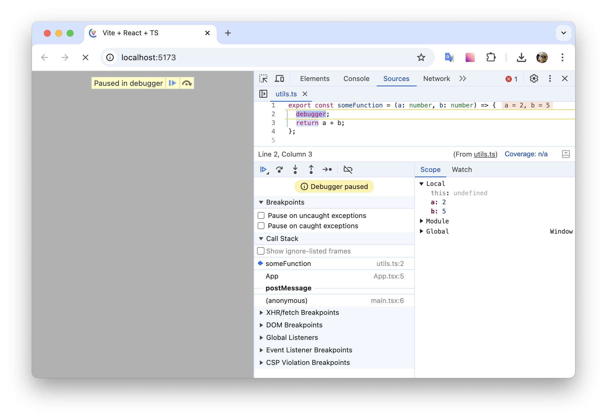

*Использование debugger*

2. Вручную во вкладке Source, кликнув по номеру строки в коде, где вы хотите остановить выполнение. После этого появится синяя метка, указывающая на установленную точку останова.

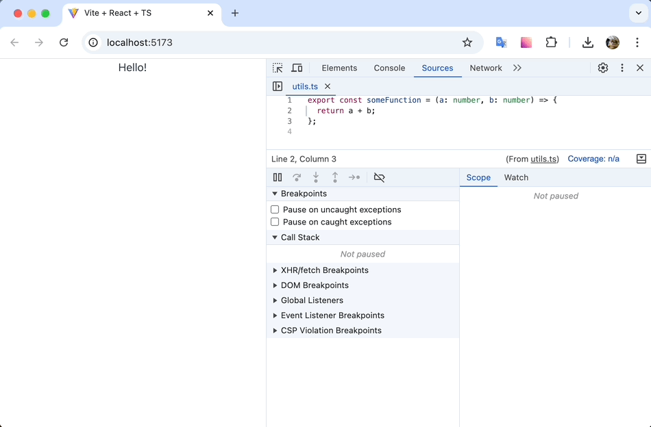

*Добавление точки останова через Sources*

## Что можно делать с точками останова?

- **Исследование переменных:** Когда выполнение дойдет до точки останова, вы сможете увидеть значения всех локальных переменных в правой панели DevTools.
- **Пошаговое выполнение:** Используйте кнопки "Step over", "Step into" и "Step out", чтобы пошагово перейти через функции. Это позволяет детально изучить, как код выполняется шаг за шагом.
- **Изменение кода на лету:** Пока выполнение остановлено, вы можете изменить код в DevTools. Это позволяет вам протестировать свои исправления в реальном времени.
- **Условные точки останова:** Вы можете установить точку останова, которая будет срабатывать только при выполнении определенного условия.

Рассмотрим подробнее некоторые функции на примере.

У нас есть следующий компонент:

```tsx
const checkSum = (sum: number) => {
  if (sum > 40) { // E
    console.log("Сумма превысила 40:", sum); // F
  }
};

export const NumberProcessor: FC<IProps> = ({ numbers }) => {
  const [result, setResult] = useState<number | null>(null);

  const processNumbers = (nums: number[]) => {
    let sum = 0;

    nums.forEach((num) => { // A
      sum += num; // B
      checkSum(sum); // C
    });

    setResult(sum); // D
  };

  return (
    <div>
      <h2>Number Processor</h2>
      <button onClick={() => processNumbers(numbers)}>Process Numbers</button>
      {result !== null && <p>Result: {result}</p>}
    </div>
  );
};
```

Для начала, установим точку останова на строчке A.

После нажатия на “Process Numbers” мы увидим, как наша программа приостановила выполнение на указанной строчке. Мы можем просмотреть, какие значения имеют текущие переменные nums и sum.

Теперь попробуем проследить за выполнением кода. Для такой навигации в дебаггере существует несколько кнопок:

- **Resume script execution** - продолжит выполнять программу до следующей точки останова, если она имеется.

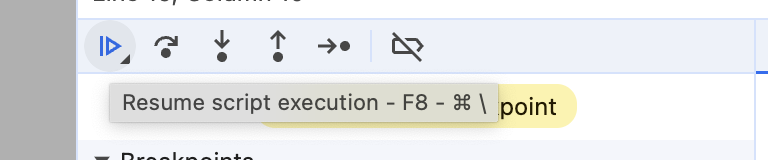

- **Step over next function call** - выполнит функцию, не заходя в неё, и перейдет к следующей строчке.

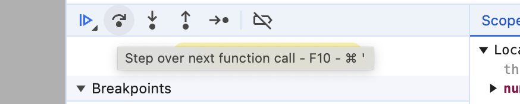

- **Step into next function call** - позволяет перейти внутрь функции, чтобы просмотреть, как она выполняется.

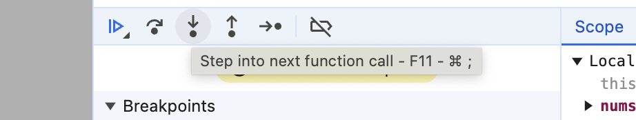

- **Step out of current function** - позволяет выйти из функции, не останавливаясь на оставшейся части кода.

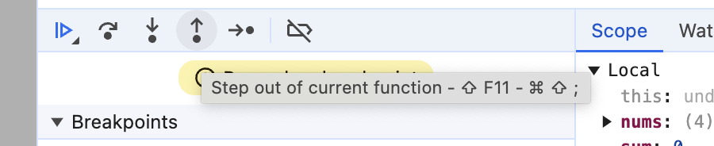

- **Step** - аналогичен Step into, но только игнорирует асинхронные функции.

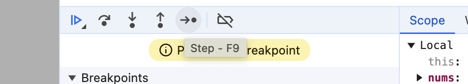

Также обратите внимание, что, несмотря на то, что мы говорим про строчки кода, на самом деле дебаггер работает не с реальными строчками, а с выражениями в коде. То есть, если мы поместим код со строчек B и C на одну строчку, например вот так:

```js
nums.forEach((num) => {
  sum += num; checkSum(sum);
});
```

то дебаггер все равно будет рассматривать `sum += num;` и `checkSum(sum);` как отдельные выражения, останавливаясь на каждом из них.

## Step over

Если, находясь на строчке A, мы используем Step over, то дебаггер переместит нас на строчку D, не заходя внутрь функции forEach.


*Навигация по коду с помощью Step over*

## Step into

Если же мы хотим подробнее посмотреть, что происходит внутри forEach, то мы можем использовать Step into. Это позволит нам провалиться внутрь функции и посмотреть детальнее, что там происходит.

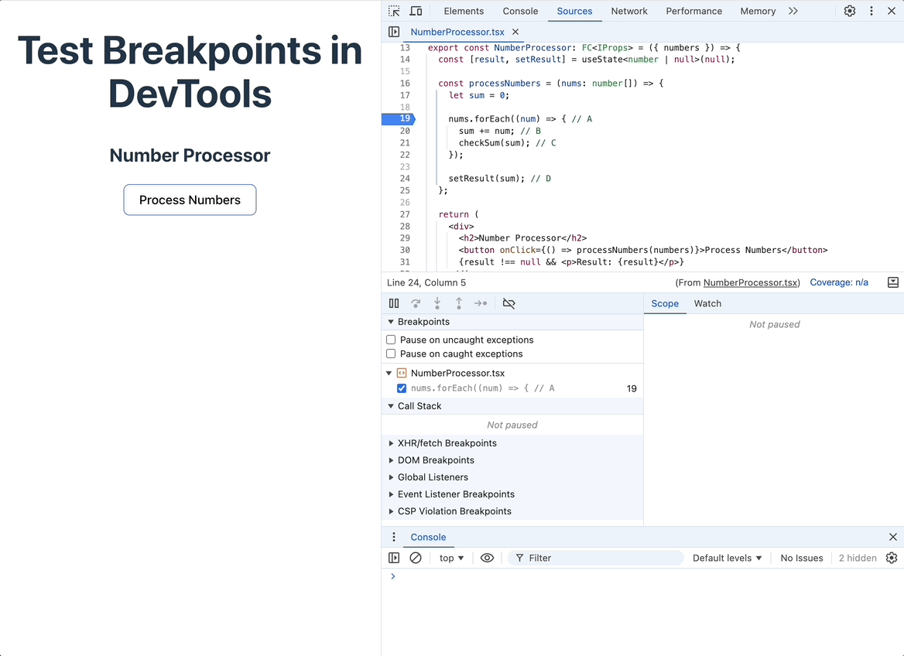

*Навигация по коду с помощью Step into*

Так как функция forEach - это цикл, то перейдя внутрь её, с помощью Step over мы можем подробно исследовать каждую итерацию этого цикла.

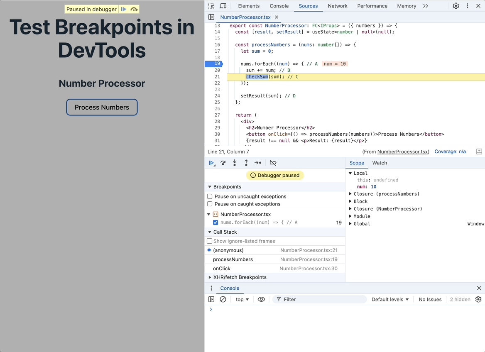

*Мы можем пройтись по всем итерациям цикла с помощью Step into и Step over*

## Step out

Если в какой-то момент мы понимаем, что дальше исследовать функцию внутри forEach нам не нужно, мы можем выйти из нее с помощью Step out. Он вернет нас на строчку D.

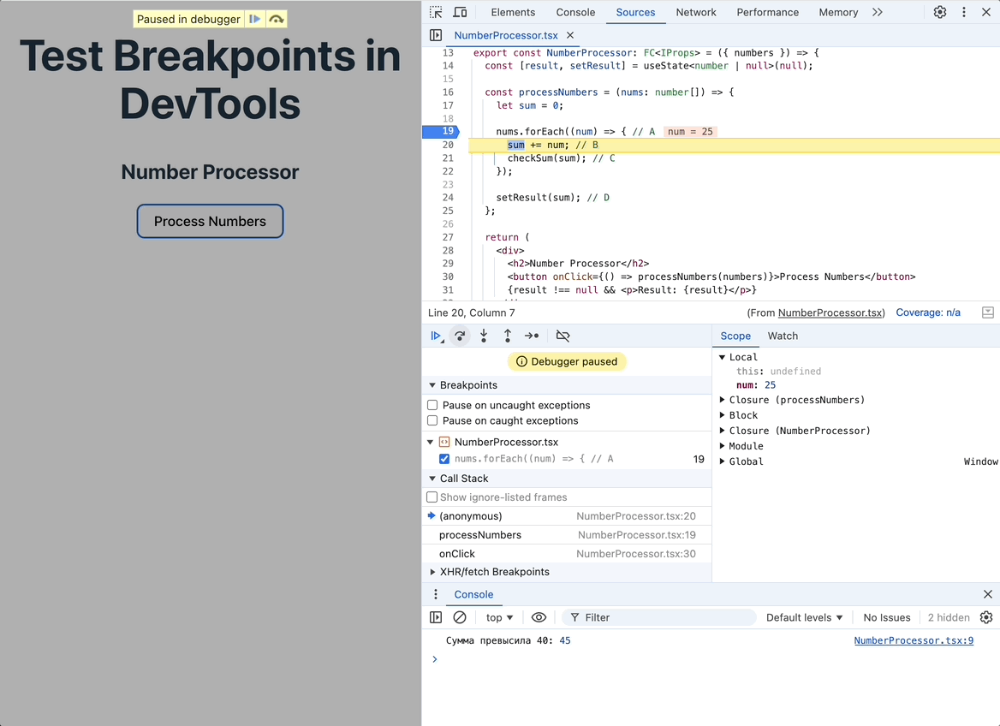

*Возврат наверх из функции с помощью Step out*

## Условные точки останова

Так как в нашем примере есть цикл, то нам вполне может понадобиться просмотреть, что происходит внутри него только при определенном значении. Для этого мы можем использовать условную точку останова.

Создадим такую на строке B. Для этого нужно кликнуть правой кнопкой на номер строки и в списке выбрать ”Add conditional breakpoint…”.

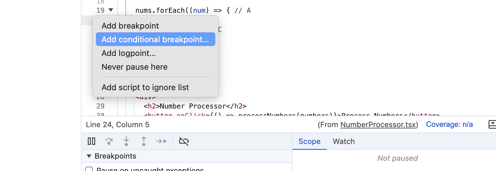

*Добавление условной точки останова*

После этого в появившемся окне вводим наше условие. В данном случае мы хотим остановиться, когда num будет равен 25.

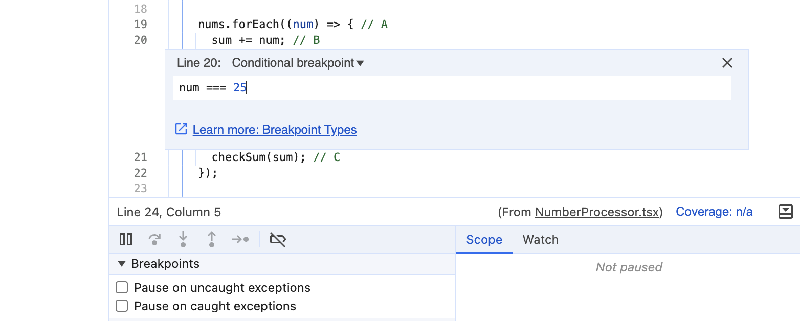

*Условие пишем с помощью обычного JavaScript*

Готово! Теперь у нас добавилась условная точка останова, которая сработает только тогда, когда условие будет выполнено.

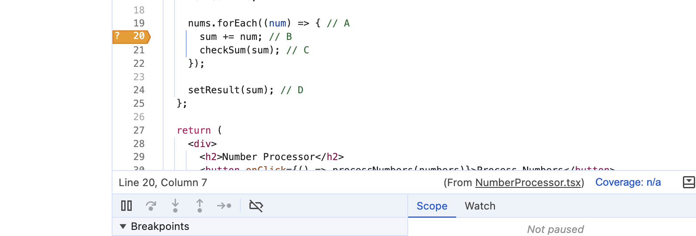

*Так выглядит условная точка останова*

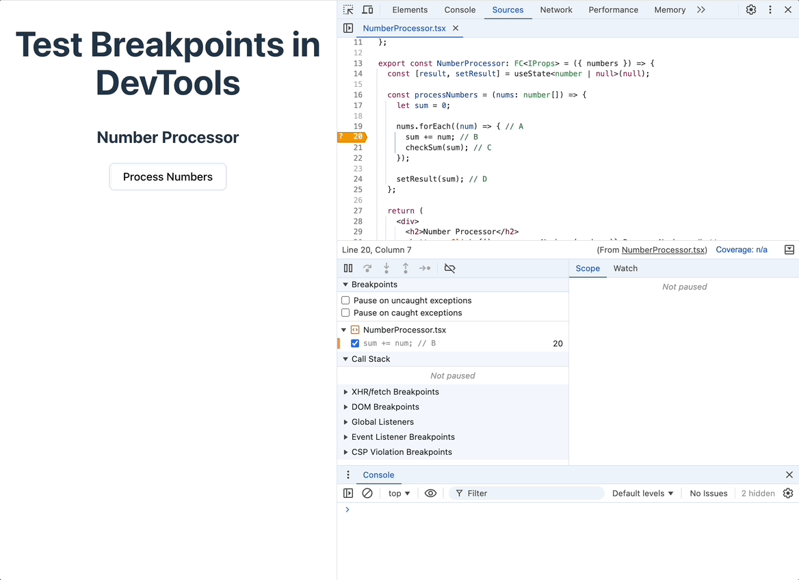

*А так такая точка останова сработает в нашем примере*

У нас может быть несколько точек останова различного типа, и мы можем деактивировать их и активировать снова.

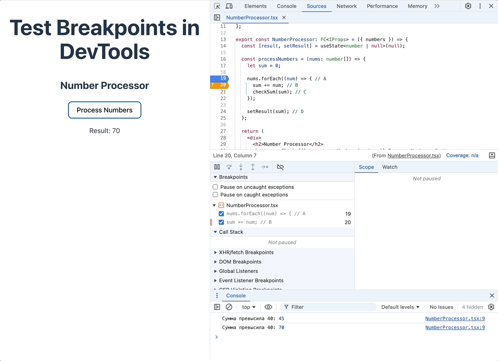

*Активация и деактивация точек останова на панели управления ими*

Также мы можем удалить любую точку останова, если она стала нам неактуальной.

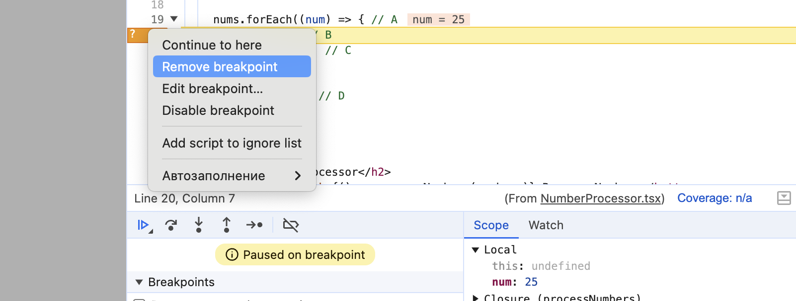

*Удаление точки останова через контекстное меню. Такого же поведения можно добиться кликнув один раз по самой точке останова в коде.*

Мы рассмотрели базовые примеры работы с точками останова в DevTools.

Подробнее про другие типы точек останова и функции для работы с ними можно прочитать в документации Google Chrome [здесь](https://developer.chrome.com/docs/devtools/javascript/breakpoints) и [здесь](https://developer.chrome.com/docs/devtools/javascript/reference).
