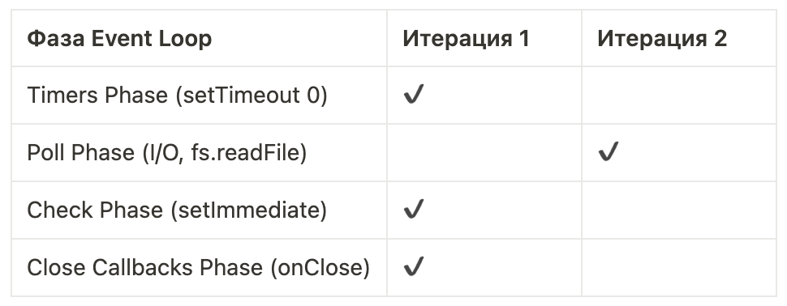
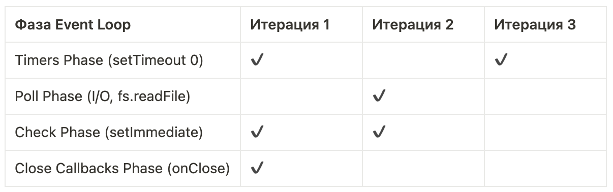

## Вопрос c собеседований

Наверняка, вы не раз слышали один из любимых вопросов интервьюеров: “Расскажите про Event Loop в JavaScript”. Как правило, речь идёт про браузерную версию JavaScript. И если нужен простой ответ, он может звучать так:

> **Event Loop** – это механизм, который позволяет JavaScript, будучи однопоточным, обрабатывать асинхронные операции. Он работает со стеком вызовов (Call Stack) и двумя очередями задач – Microtask Queue (для микрозадач) и Task Queue (для макрозадач).

Если объяснять проще, у нас есть три типа операций:

- Синхронный код – выполняется сразу в Call Stack.
- Микрозадачи – Promise.then(), выполняются сразу после синхронного кода.
- Макрозадачи – setTimeout / setInterval, выполняются последними.

Запомнить порядок просто:

1. Сначала синхронный код – он выполняется прямо сейчас, без ожиданий.
2. Потом микрозадачи – например, обработка ответа с бэкенда важнее, чем скрытие уведомления.
3. Завершают очередь макрозадачи – например, закрытие нотификации через setTimeout.

Этих знаний уже достаточно, чтобы уверенно отвечать на вопрос “Что и в каком порядке выведется в консоль при выполнении *вот такого* кода?”.

Да, в микрозадачах и макрозадачах есть другие механизмы помимо Promise и setTimeout, и сам Event Loop устроен сложнее, чем кажется на первый взгляд. Но пока этого достаточно.

## А зачем нам Loop?

Глобально, Event Loop решает важную задачу – позволяет асинхронно выполнять операции в однопоточном JavaScript, создавая иллюзию многопоточности.

Представим, что у нас есть веб-сервер, который обрабатывает входящие HTTP-запросы. Например, при запросе к определённому API-роуту сервер делает запрос в базу данных и возвращает результат.

Без механизма асинхронного выполнения, пока сервер ждёт ответа от базы данных, он был бы заблокирован – не мог бы обрабатывать другие запросы, даже если процессор при этом простаивает.

Какие есть варианты решения этой проблемы?

1. Многопоточность – подход, который использовал Apache. Он мог создавать отдельный процесс или поток на каждый запрос. Чем больше запросов, тем больше ресурсов тратилось на поддержку этих процессов/потоков, что быстро упиралось в лимиты памяти.
2. Неблокирующий ввод/вывод (Non-blocking I/O) – подход, на котором [основан Nginx](https://blog.nginx.org/blog/inside-nginx-how-we-designed-for-performance-scale) и, собственно, Event Loop в JavaScript. Вместо создания отдельных потоков, операции выполняются асинхронно, и когда одна задача “ждёт” (например, загрузку данных), CPU может заняться другими задачами.

Event Loop делает это возможным, управляя очередями задач и освобождая основной поток для выполнения других операций. Это позволяет, в частности, серверу на Node.js обрабатывать тысячи соединений одновременно, даже несмотря на то, что он формально работает в однопоточном режиме.

## Чем Event Loop в Node.js отличается от Event Loop в браузере?

Мы разобрали, как работает Event Loop в браузере. Теперь пришло время взглянуть на него в Node.js.

Базовые принципы схожи: есть синхронный код, макро- и микрозадачи. Но различия начинаются уже с того, как именно обрабатываются макрозадачи – в Node.js они проходят через шесть фаз вместо одной общей очереди.

Вот последовательность этих фаз:

1. **Timers** – выполняются колбэки, запланированные через setTimeout() и setInterval().
2. **Pending Callbacks** – выполняются колбэки операций, которые отложены по системным причинам (например, ошибки TCP).
3. **Idle, Prepare** – внутренняя фаза движка V8.
4. **Poll** – главная фаза ввода-вывода: здесь выполняются I/O-операции (fs.readFile, сетевые запросы и т. д.). Если дальше задач нет, Event Loop может здесь зависнуть и ждать новых событий.
5. **Check** – выполняются колбэки setImmediate().
6. **Close Callbacks** – обрабатываются колбэки закрытия (socket.on('close')).

Но это ещё не всё. После каждой из этих фаз выполняется очередь микрозадач – Promise.then(), queueMicrotask(), а также… таинственный process.nextTick(), который вообще не является микрозадачей и выполняется раньше них.

Шесть фаз, микрозадачи, nextTick() – как это всё запомнить и понять, что когда выполняется? Давайте разбираться.

## Порядок фаз в Event Loop

Для начала отбросим две менее интересные для нас фазы – “Pending Callbacks” и “Idle, Prepare”. Они редко встречаются в реальных сценариях, поэтому сосредоточимся на **четырёх ключевых фазах**, которые можно увидеть вживую в коде.

Разберёмся, как именно Node.js проходит через эти фазы, на конкретном примере:

```js
const fs = require("fs");

console.log("🟢 1. Начало синхронного кода");

// 🔹 Микрозадачи и nextTick
process.nextTick(() => console.log("⚡ nextTick"));
Promise.resolve().then(() => console.log("⚡ Promise.then"));

// 🔹 Таймер (Timers Phase)
setTimeout(() => console.log("⏳ setTimeout (Timers Phase)"), 0);

// 🔹 setImmediate (Check Phase)
setImmediate(() => console.log("⏩ setImmediate (Check Phase)"));

// 🔹 I/O операция (Poll Phase)
fs.readFile(__filename, () => {
  console.log("📂 fs.readFile (Poll Phase)");
});

// 🔹 Событие закрытия (Close Callbacks Phase)
const readable = fs.createReadStream(__filename);
readable.close();
readable.on("close", () => console.log("🚪 onClose (Close Callbacks Phase)"));

console.log("🟢 2. Конец синхронного кода");
```

Этот код даёт следующий порядок вывода:

```
🟢 1. Начало синхронного кода
🟢 2. Конец синхронного кода
⚡ nextTick
⚡ Promise.then
⏳ setTimeout (Timers Phase)
⏩ setImmediate (Check Phase)
🚪 onClose (Close Callbacks Phase)
📂 fs.readFile (Poll Phase)
```

Что здесь важно заметить:

1. Сначала выполняется весь синхронный код, ещё до того, как запускается Event Loop.

2. После этого выполняются микрозадачи и nextTick:

- `process.nextTick()` – это самая приоритетная очередь, она выполняется первой.
- `Promise.then()` –  микрозадача, выполняется сразу после nextTick.

3. Только после этого запускается сам Event Loop, который проходит через основные фазы.

Чтобы было проще воспринимать процесс, представим его в виде таблицы:



*Фазы и ключевые итерации Event Loop*

**Почему Poll Phase (fs.readFile()) оказалась во второй итерации?**

Потому что Node.js требуется время, чтобы прочитать файл, и эта операция не успевает выполниться в первую итерацию Event Loop.

**Почему onClose() выполнился в первой итерации?**

Потому что `readable.close()` был вызван ещё в синхронном коде, и `onClose()` уже был готов к выполнению в Close Callbacks Phase.

Теперь усложним наш пример. Добавим в обработчик `fs.readFile()` несколько новых операций:

```js
// 🔹 I/O операция (Poll Phase)
fs.readFile(__filename, () => {
  console.log("📂 fs.readFile (Poll Phase)");

  setTimeout(() => console.log("⏳ setTimeout внутри fs.readFile"), 0);
  setImmediate(() => console.log("⏩ setImmediate внутри fs.readFile"));
  process.nextTick(() => console.log("⚡ nextTick внутри fs.readFile"));
});
```

Порядок вывода будет таким:

```
🟢 1. Начало синхронного кода
🟢 2. Конец синхронного кода
⚡ nextTick
⚡ Promise.then
⏳ setTimeout (Timers Phase)
⏩ setImmediate (Check Phase)
🚪 onClose (Close Callbacks Phase)
📂 fs.readFile (Poll Phase)
⚡ nextTick внутри fs.readFile
⏩ setImmediate внутри fs.readFile
⏳ setTimeout внутри fs.readFile
```

Какие изменения:

1. Все предыдущие операции выполняются в таком же порядке, что и раньше.
2. Добавился новый `nextTick`, который выполняется сразу после `fs.readFile()`, но до других операций в этом обработчике.
3. `setImmediate()` внутри `fs.readFile()` выполняется раньше `setTimeout()`, потому что Check Phase идёт перед Timers Phase.

Обновим таблицу с фазами:



*Фазы и ключевые итерации Event Loop в обновленном примере*

**Почему nextTick внутри fs.readFile() сработал сразу?**

Потому что nextTick() не зависит от фаз Event Loop и выполняется прямо после текущего кода, перед следующей фазой цикла.

## Выводы

Мы разобрались, что **Event Loop** – это сердце асинхронности в JavaScript, которое позволяет нам не блокировать выполнение кода и обрабатывать задачи в правильном порядке. Погрузились в отличия между Event Loop в браузере и Node.js и на примере прошлись по фазам Event Loop, разобравшись, в каком порядке выполняются таймеры, колбэки I/O, setImmediate и прочие важные вещи.

Однако, мы не затронули кучу интересных тем, например:

- Что делает libuv и как это связано с Event Loop?
- Можно ли реально предсказать порядок выполнения кода во всех случаях?
- Что происходит в фазах “Pending Callbacks” и “Idle, Prepare”?
- Когда Node.js успевает читать файлы, если Poll Phase обрабатывает только готовые I/O события?
- Как работают серверы на Node.js, и правда ли, что если один запрос завис, то весь сервер “повиснет” и перестанет принимать другие?
- Если Node.js однопоточный, то как он работает на многоядерных компьютерах?
- И можно ли сделать Node.js реально многопоточным?

Event Loop, да и сам Node.js — это глубокая тема, и мы только начали разбираться в его механиках. Дальше — больше!
