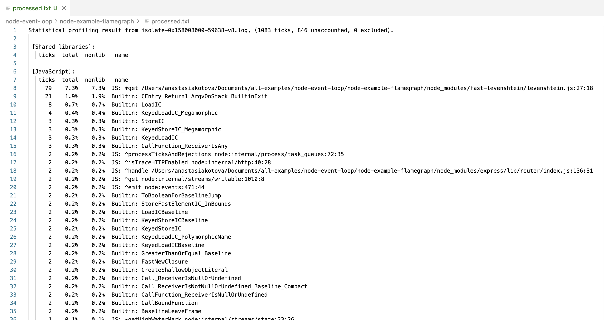
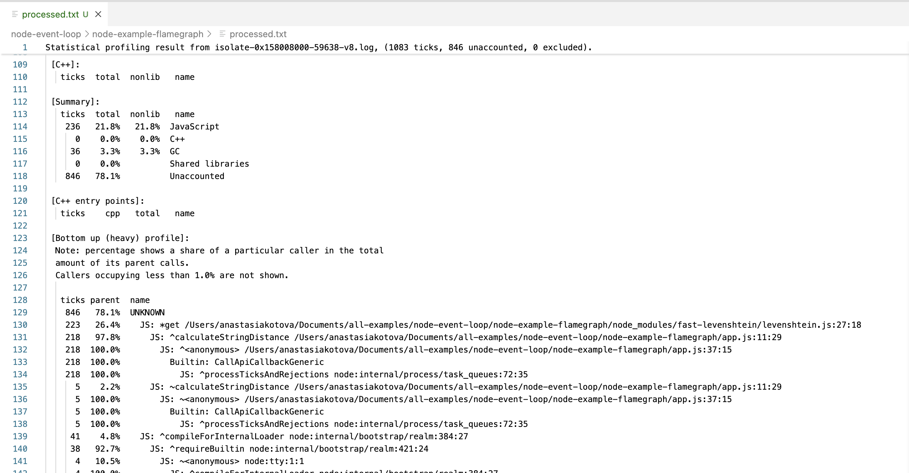
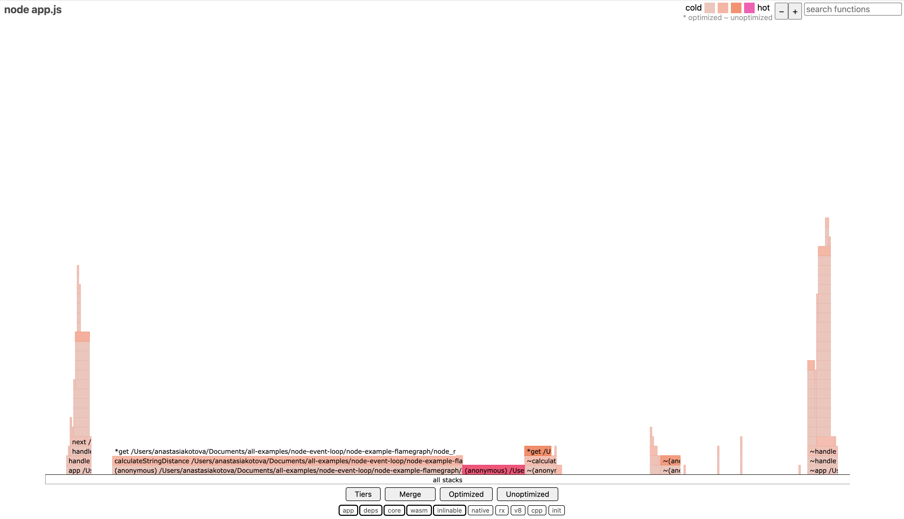
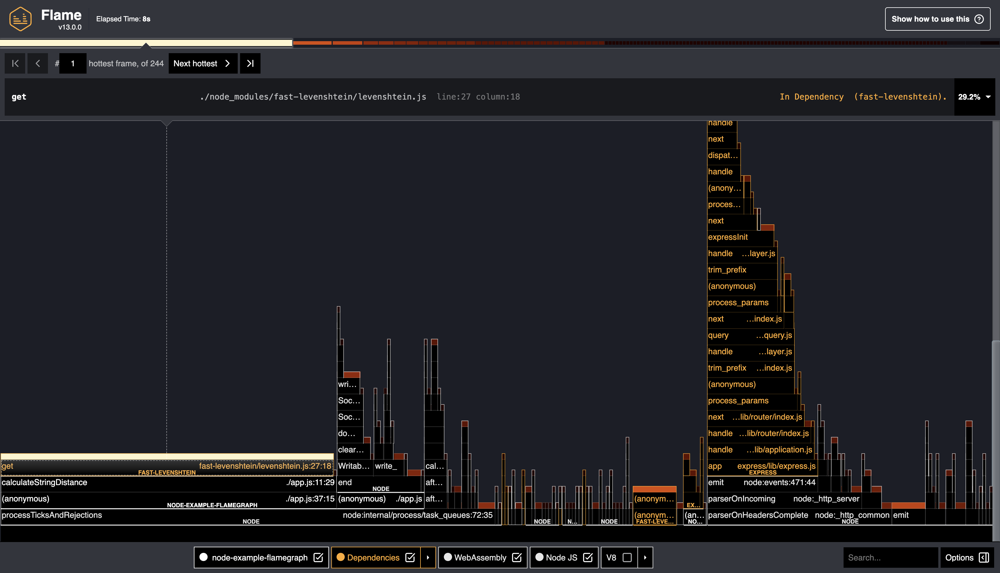
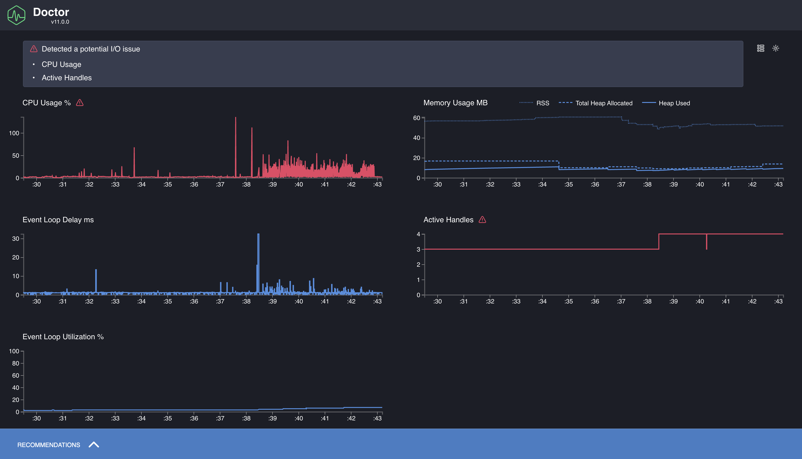

Мы уже разобрались, как устроен Event Loop в Node.js, чем он отличается от браузерного, почему Node.js нельзя считать строго однопоточной средой и как всё-таки добиться параллельности при выполнении кода. В этой — финальной — части цикла хочется поговорить о том, **как понять, что с приложением что-то не так**, и **что с этим делать**.

Иногда кажется, что «всё нормально»: код работает, сервер отвечает, ошибок нет. Но в реальности Event Loop может не справляться, запросы начинают тормозить, а пользователи — жаловаться. Эти проблемы не всегда очевидны, особенно если не смотреть вглубь и не измерять, где именно приложение теряет время.

## Что можно замерять и зачем это делать

Node.js-приложение — это большое количество разных компонентов: Event Loop, очередь микрозадач, обработка файлов, запросы к сети, сборщик мусора и модули C++. Каждый из этих участков может стать узким местом. А иногда всё кажется быстрым — пока не запустить нагрузочный тест и не увидеть, как Event Loop захлёбывается от работы.

Что вообще можно профилировать:

- **Время выполнения кода.** Простая, но критичная метрика. Иногда достаточно тяжёлой регулярки или цикла внутри промиса, чтобы всё начало лагать.
- **Задержки Event Loop.** Даже если код асинхронный, Event Loop может не успевать обрабатывать задачи, потому что в какой-то момент его что-то заблокировало.
- **Нагрузка на CPU.** В Node.js любые синхронные вычисления выполняются в основном потоке. Это значит, что один тяжёлый for может замедлить все остальные запросы.
- **Операции с памятью.** Если приложение начинает потреблять всё больше памяти — можно столкнуться с утечками и неожиданным поведением сборщика мусора.
- **Асинхронные цепочки.** Иногда промисы или setTimeout вызываются слишком часто, или навешано слишком много слушателей.
- **Зависшие ресурсы.** Таймеры, сокеты и стримы, которые “забыли закрыть”, мешают завершению процесса и грузят Event Loop впустую.

Однако в этой статье мы сфокусируемся на **двух ключевых направлениях**, которые влияют на производительность уже на раннем этапе:

1. **Время выполнения кода (CPU-bound задачи)**
2. **Состояние и здоровье Event Loop**

Мы посмотрим, как это можно замерить встроенными средствами Node.js и какими продвинутыми инструментами воспользоваться для профилирования.

## Базовые метрики в Node.js

Допустим, у нас есть кусок кода, который почему-то работает подозрительно долго. Вроде бы всё асинхронно, но API отвечает с задержкой, а иногда сервер будто на мгновение замирает. Чтобы проверить, где именно уходит время, начнём с самого простого — **замеров времени выполнения**.

Возьмём для примера странный код, в котором используется “безобидная” регулярка:

```js
const text = 'a'.repeat(20) + '!';
const pattern = /(a+)+$/;

const start = Date.now();
pattern.test(text);
console.log(`Время выполнения: ${Date.now() - start} мс`);
```

На коротких строках всё отрабатывает мгновенно. Но если подставить определённую последовательность, время выполнения может вырасти в десятки и даже сотни миллисекунд. Это классический пример плохой регулярки, про которые мы уже говорили в [третьей части](/blog/event-loop-nodejs-part-3/), и `Date.now()` позволяет заметить лаг. Однако есть нюанс: `Date.now()` зависит от системных часов, а они могут скакать — например, если пользователь меняет время вручную. В условиях профилирования это создаёт ненадёжность: миллисекунды могут “потеряться” или “добавиться” не по вине нашего кода.

Вместо `Date.now()` можно использовать модуль `perf_hooks`, встроенный в Node.js. Он даёт более стабильные и точные средства измерения времени. В частности, `performance.now()` показывает, сколько времени прошло с момента запуска процесса — идеально для замеров внутри одного выполнения.

Перепишем наш пример с `perf_hooks`:

```js
const { performance } = require('perf_hooks');

const text = 'a'.repeat(20) + '!';
const pattern = /(a+)+$/;

const start = performance.now();
pattern.test(text);
const end = performance.now();

console.log(`Время выполнения: ${(end - start).toFixed(3)} мс`);
```

Этот подход надёжнее: он не зависит от системного времени и даёт высокую точность. Помимо `performance.now()`, в `perf_hooks` есть и более продвинутые средства — например, `performance.mark()` и `performance.measure()`, которые позволяют расставлять метки в коде и потом измерять расстояние между ними, даже асинхронно. Это удобно, если хочется понять, сколько времени занимает какой-то этап обработки, не засоряя код ручными расчётами.

И, раз уж мы говорим про Event Loop, нельзя обойти стороной `monitorEventLoopDelay()` — инструмент, который показывает, насколько сильно цикл событий захлёбывается от нагрузки.

Вот пример, в котором Event Loop явно страдает:

```js
const { monitorEventLoopDelay } = require('perf_hooks');

const h = monitorEventLoopDelay({ resolution: 10 });
h.enable();

setTimeout(() => {
  const start = Date.now();

  // Симулируем блокировку Event Loop
  const now = Date.now();
  while (Date.now() - now < 300) {}

  const end = Date.now();
  console.log(`Синхронная блокировка заняла: ${end - start} мс`);

  setTimeout(() => {
    h.disable();
    console.log(`Event Loop delay (mean): ${(h.mean / 1e6).toFixed(2)} мс`);
    console.log(`Event Loop delay (max): ${(h.max / 1e6).toFixed(2)} мс`);
  }, 100);
}, 100);
```

Результат запуска может быть таким:

```
Синхронная блокировка заняла: 300 мс
Event Loop delay (mean): 26.85 мс
Event Loop delay (max): 311.43 мс
```

В этом примере мы намеренно блокируем Event Loop на 300 миллисекунд. Замеры покажут, что max-задержка резко возросла, хотя средняя (mean) может остаться ниже — ведь всё остальное время Event Loop дышал нормально. Это хороший способ заметить единичные “затыки”, которые иначе прошли бы незамеченными.

Однако у `performance.now()` и `monitorEventLoopDelay()` есть ограничения: они измеряют время в миллисекундах (пусть и с высокой точностью), и иногда хочется ещё более тонкой настройки. В таких случаях на помощь приходит `process.hrtime`.

`process.hrtime` возвращает время с наносекундной точностью. Его удобно использовать для вычисления относительных замеров, особенно в синхронном коде:

```js
const start = process.hrtime.bigint();
pattern.test(text);
const end = process.hrtime.bigint();

console.log(`Время выполнения: ${(end - start) / BigInt(1e6)} мс`);
```

В отличие от `performance.now()`, здесь результат нужно делить на 1e6, чтобы получить миллисекунды — зато точность действительно выше, а влияние фоновых процессов минимально. Этот подход особенно ценен, если нужно профилировать критичный участок кода и хочется, чтобы замеры были максимально стабильными между запусками.

При этом `process.hrtime` чуть менее удобен в использовании и не так хорошо интегрируется с остальными средствами `perf_hooks` — например, с `performance.measure()`. Поэтому на практике `performance.now()` чаще используется для повседневных задач, а `hrtime` — когда нужна высочайшая точность.

Однако, все эти замеры — это скорее ручная работа. Да, она полезна для точечной диагностики, но когда нужно понять общую картину, следить за “здоровьем” Event Loop или искать узкие места в целом приложении, одного `console.log` уже может не хватить.

## Инструменты для анализа и профилирования

В этом блоке я покажу, как можно анализировать поведение кода с помощью настоящих профилировщиков — от встроенных инструментов до удобных внешних тулов.

Для экспериментов я использовала вот этот демо-репозиторий: [github.com/naugtur/node-example-flamegraph](https://github.com/naugtur/node-example-flamegraph)

Он специально создан для демонстрации “тормозов” Node.js-приложения. С помощью переменной `HOW_OBVIOUS_THE_FLAME_GRAPH_SHOULD_BE_ON_SCALE_1_TO_100` можно управлять уровнем нагрузки: чем выше значение, тем заметнее проблемы на профиле.

**node --prof и node --prof-process**

Начнём с самого низкоуровневого инструмента, который есть в самой Node.js. Это встроенный профилировщик V8, который снимает сэмплы выполнения и сохраняет их в текстовый файл.

Чтобы запустить его, нужно использовать две команды:

```bash
node --prof app.js
```

После завершения работы создастся файл, похожий на `isolate-0x*.log` (например, у меня `isolate-0x158008000-59638-v8.log`). Его нужно обработать:

```bash
node --prof-process isolate-0x158008000-59638-v8.log > processed.txt
```

В результате получится отчёт, где будет видно, какие функции занимали больше всего времени, насколько часто они вызывались и как выглядел вызов CPU.



*Результат обработки node --prof-process, начало файла*



*Результат обработки node --prof-process, середина файла*

Этот инструмент использует внутренние средства самого движка V8 и показывает **сырой профиль исполнения**, включая даже вызовы на уровне C++. Однако, у него есть и минусы.

Во-первых, интерфейс практически нечитаемый. Все имена функций перемешаны с внутренними вызовами. Во-вторых, нет никаких визуализаций — только текст. Чтобы разобраться в профиле, нужно обладать недюжинной силой воли, или использовать обёртки, вроде 0x.

**0x: быстрый flamegraph без боли**

[0x](https://github.com/davidmarkclements/0x) — это обёртка над `--prof`, которая делает всё то же самое, но с визуализацией. Он запускает код, собирает профиль и автоматически генерирует HTML-файл с flamegraph.

Пример запуска:

```
0x app.js
```

После выполнения мы получаем `flamegraph.html`, где можно визуально увидеть, какая функция сколько времени провела на CPU. Ширина каждого блока пропорциональна времени — чем шире, тем дольше выполнялся код.



*Результат выполнения 0x, файл flamegraph.html*

С 0x удобно анализировать **CPU-bound** участки — например, тяжёлые циклы, вычисления, проблемные регулярки. Он не показывает async-зависимости, зато идеально подходит, если нужно быстро понять, где именно “горит” процессор.

**clinic: общее обследование**

[clinic](https://clinicjs.org/) — это набор утилит, который включает `clinic flame`, `clinic doctor` и `clinic bubbleprof`. В данном случае нас интересует `clinic flame` — он делает почти то же самое, что и 0x, но с чуть более детальной визуализацией и удобной обёрткой.

Команда для запуска:

```
clinic flame -- node app.js
```

По завершении откроется HTML-отчёт с flamegraph. Можно кликать по функциям, смотреть стеки вызовов, приближать участки и сохранять вывод.



*Отчет clinic flame*

Отличие от 0x — чуть больше информации в визуализации и совместимость с остальными инструментами clinic.

Когда не совсем понятно, что именно тормозит — CPU, Event Loop, или что-то с памятью — удобно начать с более общей диагностики. Для этого есть `clinic doctor`. Он собирает несколько типов метрик одновременно: нагрузку на процессор, задержки Event Loop, использование памяти, частоту входящих запросов и т. д.

Команда:

```
clinic doctor -- node app.js
```

После запуска нужно немного поработать с приложением (например, открыть страницу сервера в браузере или сделать запросы через curl), а затем остановить процесс — отчёт откроется автоматически.



*Отчет clinic doctor*

На выходе мы получим общую картину: насколько равномерна нагрузка, есть ли задержки Event Loop, как ведёт себя память.

## Что такое flamegraph и как его читать

Мы посмотрели, как использовать `0x` и `clinic flame`, и получили результат в виде графа, где всё подсвечено и разложено по уровням. На первый взгляд это может выглядеть как просто красивый отчёт, но на самом деле flamegraph — мощный инструмент анализа производительности.


*Вариант отображения flamegraph в clinic*

Flamegraph — это визуализация профиля выполнения кода. Каждая функция в стеке вызовов отображается как прямоугольник. Ширина блока показывает, сколько времени эта функция провела на CPU. Чем шире блок — тем больше он «съел» времени. Все блоки укладываются в общую ширину графа, которая соответствует полной загрузке CPU за время профилирования.

Граф «растёт» снизу вверх. Нижние блоки — это то, с чего начинался стек вызовов. Верхние — то, что вызывалось внутри. Если на нижнем уровне появляется особенно широкая полоска, это верный признак узкого места: функция выполняется часто и/или долго и блокирует другие действия.

Важно: flamegraph показывает только то, что происходило на CPU. Асинхронные задержки, ожидания, промисы, таймеры — всё, что не занимало CPU, — в flamegraph не отразится. Это делает его идеальным инструментом для поиска **синхронных** затыков, но неполным — и именно поэтому `clinic` включает ещё и другие инструменты, вроде `doctor` и `bubbleprof`.

Сами flamegraph-отчёты интерактивны: можно увеличивать, искать по названию функций, просматривать стек вызовов. Это особенно полезно при анализе больших проектов, где стек может уходить в десятки уровней глубины.

## Выводы

В этой статье мы разобрались, как подступиться к профилированию Node.js-приложений: что можно замерять, какие инструменты использовать и как интерпретировать полученные результаты. Мы посмотрели, как замерять время выполнения с помощью `performance.now()` и `process.hrtime`, как отследить задержки Event Loop через `monitorEventLoopDelay()`, и как использовать профилировщики — от встроенного `--prof` до `0x` и `clinic`.

Формат flamegraph оказался особенно удобным для выявления синхронных узких мест: тяжёлых регулярок, блокирующих циклов и всего, что занимает слишком много CPU. А `clinic doctor` дал нам более широкую картину: общее поведение Event Loop, нагрузку, память, частоту запросов.

Это только основа. За ней — целый пласт тем, в которые можно углубляться дальше: профилирование в продакшене, нагрузочное тестирование, работа с памятью и её утечками, async performance.

---

На этом мой цикл статей про Event Loop в Node.js подходит к концу. Мы начали с самого начала — что такое Event Loop и чем он отличается от браузерного, разобрали фазы его работы, поняли, что не всё выполняется в рамках цикла, поговорили о многопоточности и работе с HTTP-серверами, и наконец добрались до профилирования и анализа производительности.

Если этот цикл помог лучше понять, как работает Node.js — значит, всё было не зря.

Если захотелось покопаться глубже — вообще отлично.

Я пишу о сложных вещах в разработке, в том числе, чтобы самой лучше разобраться в них. Если хочется читать такие разборы регулярно — подписывайся на мой [Telegram-канал](https://t.me/startpoint_dev) (если ещё нет). Там появляются не только статьи, но и заметки, мысли и маленькие полезности.

Спасибо, что дочитали до конца. Увидимся в следующем цикле!)
