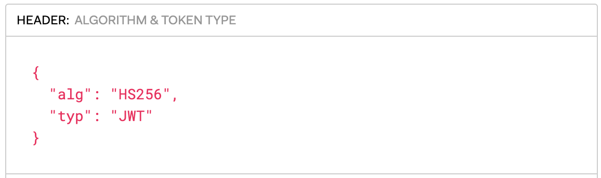
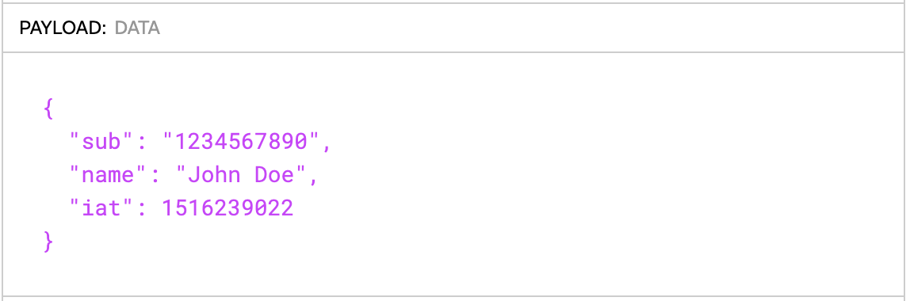
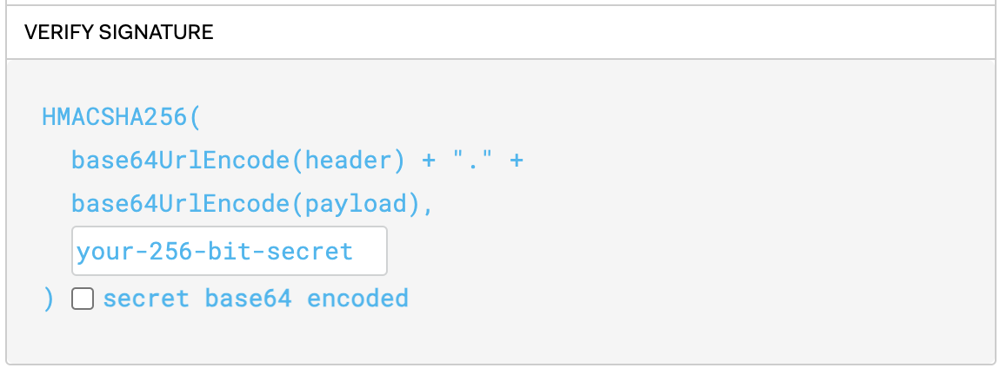
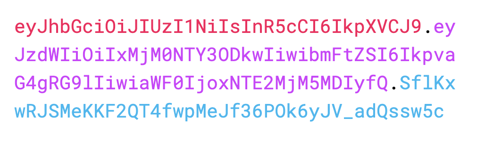

**JSON Web Token (JWT)** — это открытый стандарт для создания токенов доступа, которые позволяют передавать информацию в самих токенах в закодированном виде. Чаще всего JWT используют для того, чтобы аутентифицировать пользователя в клиент-серверных приложениях.

### Структура JWT

JWT состоит из трех частей, разделенных точками:

**1.** **Header (Заголовок)** — содержит информацию о типе токена (обычно "JWT") и алгоритме шифрования (обычно используется HS256 или RS256).

*Header в JWT-токене*

А в зашифрованном виде вот так: eyJhbGciOiJIUzI1NiIsInR5cCI6IkpXVCJ9

**2. Payload (Полезная нагрузка)** — здесь хранится нужная информация о пользователе и токене. Для этого стандартом зарезервированы некоторые ключи, но все они являются необязательными. Помимо этих ключей можно добавлять любые другие.

*Payload в JWT-токене*

Здесь sub и iat - зарезервированные ключи, указывающие на то, кому был выдан токен, а также на время выдачи токена.

В зашифрованном виде: eyJzdWIiOiIxMjM0NTY3ODkwIiwibmFtZSI6IkpvaG4gRG9lIiwiaWF0IjoxNTE2MjM5MDIyfQ

**3. Signature (Сигнатура)** — используется для проверки правильности и подлинности токена. Закодированные при помощи base64 `header` и `payload` сцепляются в одну строку при помощи разделителя — точки. Получившуюся строку кодируют при помощи выбранного алгоритма и секретного ключа.

*Формула для получения сигнатуры*

`your-256-bit-secret` — это ключ для шифровки и проверки подписи. Он создается и сохраняется на сервере, используется для подписи токена при его генерации, а также служит для проверки подлинности токена при его получении.

Крайне важно гарантировать безопасность этого ключа, ведь обладая этим ключом, можно создать любые токены для вашего приложения, которые будут считаться действительными. Главным требованием для ключа является стойкость к алгоритмам перебора (брутфорс-атакам).

Итоговый токен получается путем соединения через точку всех трех частей:

*Итоговый JWT-токен*

На специальном сайте [https://jwt.io/](https://jwt.io/) можно посмотреть подробнее на структуру JWT-токена.

### Где и как используются JWT-токены

**1. Создание токена**:

- Клиент (например, браузер) аутентифицируется и отсылает свои учетные данные на сервер.
- Сервер проверяет учетные данные, и если всё верно, создаёт JWT и отправляет его обратно клиенту. Токен подписывается с использованием секретного ключа, который знает только сервер.

**2. Использование токена**:

- В последующих запросах клиент отправляет JWT, например, в заголовке HTTP-запроса (Authorization: Bearer \<TOKEN\>).
- Сервер получает токен, декодирует его, проверяет сигнатуру с использованием известного ему секретного ключа и, если сигнатура верна, использует информацию из полезной нагрузки токена.

### Преимущества JWT

1. **Масштабируемость**: Поскольку серверу не нужно хранить сессии для каждого пользователя где-нибудь в базе данный, а каждый выданный токен является самодостаточным, такая система легко масштабируется горизонтально.
2. **Безопасность**: JWT подписывается секретным ключом, что предотвращает его подделку. Ключ может быть асимметричным (RSA или ECDSA), что добавляет дополнительный уровень безопасности.
3. **Простота интеграции**: JWT широко поддерживается многими языками программирования и библиотеками, что упрощает его интеграцию.

### Недостатки JWT

1. **Размер токена**: В отличие от сеансов на стороне сервера, JWT может быть достаточно большим из-за зашифрованного формата и потенциального содержания большой полезной нагрузки, что увеличивает размер HTTP-запросов.
2. **Невозможность легко аннулировать токен**: JWT, которые были подписаны и отправлены клиенту, не могут быть аннулированы или отозваны до истечения их срока действия, если сервер не предусматривает специального механизма для этого (например, "черные списки").

Для того, чтобы усилить надежность и удобство аутентификации, чаще всего в приложениях используют специальную связку из двух видов JWT-токенов - access и refresh.

### Access и refresh токены

Давайте рассмотрим, как эти два вида токенов работают вместе и какие преимущества они предоставляют.

**Access токен (токен доступа)** — это JWT, который содержит данные о пользователе и/или его правах доступа. Этот токен используется для получения доступа к защищенным ресурсам на сервере.

**Свойства access токенов**

\- Кратковременность: access токены имеют относительно короткий срок действия (например, 15 минут или 1 час) для минимизации риска, если токен будет скомпрометирован.

\- Использование: клиент отправляет access токен в заголовке HTTP-запросов (Authorization: Bearer \<ACCESS\_TOKEN\>), чтобы получить доступ к защищенным ресурсам.

**Refresh токен (токен обновления)** — это JWT или другой специфический токен (не всегда JWT), который используется для получения нового access токена без повторной аутентификации пользователя.

**Свойства refresh токенов**

\- Долгоживущие: refresh токены имеют более длительный срок действия по сравнению с access токенами (например, несколько дней или недель), но и должны храниться более безопасно.

\- Использование: когда access токен истекает, клиент отправляет refresh токен на сервер для получения нового access токена.

### Применение Access и Refresh токенов

1. **Аутентификация**:

\- Пользователь вводит свои учетные данные (логин и пароль).

\- Сервер проверяет учетные данные, создает access и refresh токены и возвращает их клиенту.

2. **Доступ к защищенным ресурсам**:

\- Клиент отправляет access токен в заголовке HTTP-запросов для получения доступа к защищенным ресурсам.

\- Сервер проверяет access токен, и если он действителен, предоставляет доступ к ресурсу.

3. **Обновление токена**:

\- Когда access токен истекает, клиент отправляет запрос на сервер с refresh токеном.

\- Сервер проверяет refresh токен, создает новый access токен и возвращает его клиенту.

При использовании связки access и refresh токенов также важно учитывать следующее:

\- **Безопасность хранения**: access токены могут храниться в памяти фронтенд-приложения или в LocalStorage, в то время как refresh токены рекомендуется хранить в более защищенном месте (например, в безопасных зашифрованных куки - HTTP-Only, Secure)

\- **Отзыв токенов**: refresh токены могут быть явно отозваны или помещены в черный список, предоставляя возможность эффективно управлять сессиями пользователей.
