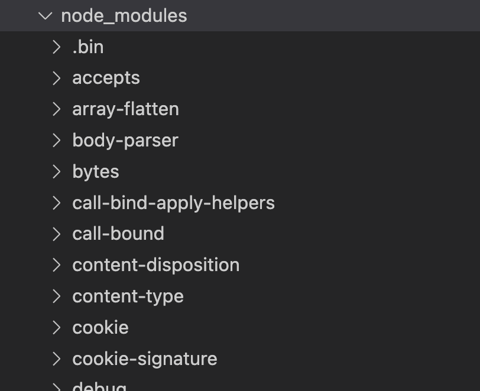
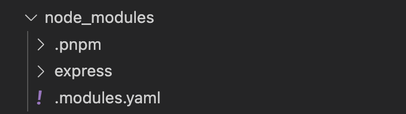
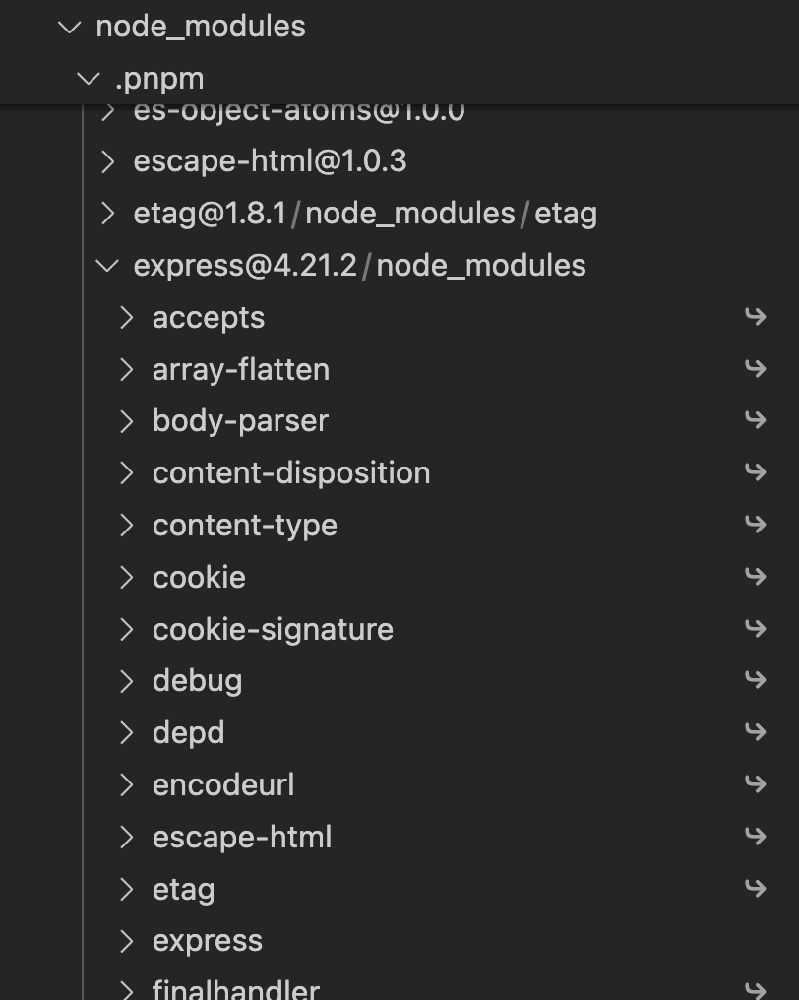

**Pnpm** ("Performance npm") — это современная альтернатива пакетному менеджеру npm. Основная цель pnpm - улучшение производительности и оптимизация использования дискового пространства при работе с проектами.

Рассмотрим несколько аспектов pnpm, которые (спойлер) делают его весьма привлекательным.

## Экономия дискового пространства

Одним из ключевых отличий pnpm является его подход к хранению пакетов.

Npm дублирует пакеты в каждой новой установке для каждого из ваших проектов. Pnpm же использует ссылочное хранение.

Это означает, что все пакеты хранятся в одном общем месте на вашем компьютере, а проекты получают доступ к ним через **жесткие ссылки**. Такой подход значительно экономит дисковое пространство и ускоряет процесс локальной установки зависимостей.

> Жёсткая ссылка в операционной системе — это файл-ссылка, которая указывает непосредственно на те же данные на диске, что и другой файл. В отличие от символической ссылки, жёсткая ссылка не является отдельным файлом, а просто другой именованной точкой доступа к данным.

## Безопасность зависимостей

### Как работает в npm

В npm, начиная с 3 версии, при установке зависимостей для оптимизации дискового пространства используется подход с [flattened dependency tree](https://github.com/npm/npm/issues/6912) (выравнивание дерева зависимостей).

Сейчас в корне `node-modules` будут находиться не только пакеты, которые указаны в `package.json`, но и их зависимости. А это позволит разработчику потенциально обратиться к такому пакету в коде проекта.

Хороший пример приводится в статье ["pnpm's strictness helps to avoid silly bugs"](https://www.kochan.io/nodejs/pnpms-strictness-helps-to-avoid-silly-bugs.html).

> Cоздайте пустой проект и выполните в нём `npm install express --save`. Дальше перейдите в папку `node_modules`, которая была создана, и выполните там `ls -1`. Вы получите примерно такой вывод:

```
accepts
array-flatten
content-disposition
content-type
cookie
cookie-signature
debug
depd
destroy
...
```

> Как вы видите, даже если вы установили только `express`, в папке `node_modules` доступно гораздо больше пакетов. Node.js неважно, что находится в вашем `package.json` файле, у вас будет доступ ко всем пакетам, которые находятся в корне `node_modules`. Таким образом, вы можете начать использовать все эти пакеты, даже не устанавливая их явно.

(И да, я проверила этот пример на npm 10.5.0 и оно так и работает)



*Вот так выглядят node\_modules проекта с одной зависимостью в виде express*

### Как работает в pnpm

Pnpm решает эту проблему по другому. При его использовании в корне `node_modules` будут лежать только те пакеты, которые указаны в package.json. Благодаря механизму символических ссылок все вложенные зависимости для пакетов будут изолированы и недоступны для использования в вашем проекте напрямую.

> Символическая ссылка (или "симлинк") в файловых системах — это специальный тип файла, который служит указателем на другой файл или директорию. Симлинки работают как переадресация или ярлыки, позволяя обращаться к файлу или папке, даже если они находятся в другом месте файловой системы.

### Пример с express

Если мы возьмем тот же самым пример с express, но используем pnpm вместо npm то увидим следующее.



*Папка node\_modules того же проекта с express, но при использовании pnpm*

В корне `node_modules` будет лежать симлинк на конкретную версию библиотеки, установленную в папке  `node_modules/.pnpm`

И далее уже в папке библиотеки express в `node_modules` будут лежать симлинки на все её зависимости.



*Если раскрыть папку .pnpm, то можно увидеть эту иерархию символических ссылок*

Таким образом, больше не нужно использовать подход выравнивания дерева зависимостей и поднимать все пакеты в корень `node_modules`, как это сделано в npm, потому что вся нужная иерархия зависимостей организована с помощью символических ссылок.

## Обратная совместимость с npm

Изначально pnpm позиционировался как полностью совместимый по CLI с npm, однако на данный момент уже существуют некоторые различия (например, добавление нового пакета через `pnpm add` вместо `npm install`).

Однако по-прежнему, миграция с npm на pnpm проходит не так сложно. Лично мне потребовалось выполнить команду `pnpm import`, модифицировать файл `.npmrc`, переустановить зависимости с помощью pnpm и исправить пару ошибок в проекте, которые появились в результате правильного резолвинга всех используемых зависимостей и их версий (привет пункту "Безопасность зависимостей").

## Выводы

Я рассмотрела только основные ключевые особенности pnpm. Но уже по ним могу сказать, что pnpm выглядит как недооцененное, но крайне перспективное решение в мире пакетных менеджеров. И я бы рекомендовала использовать pnpm во всех проектах по умолчанию.

### Полезные ресурсы

[Интересный доклад с Holy.js про npm, pnpm и yarn](https://youtu.be/hq-gIihAs5A?si=2VS-R7VlfdC3j4j9)

[Сравнение с npm, на сайте pnpm](https://pnpm.io/pnpm-vs-npm)

[Подробное описание структуры node\_modules при работе с pnpm, на сайте pnpm](https://pnpm.io/symlinked-node-modules-structure)

[Ответ на вопрос, почему не использовать симлинки вместо жестких ссылок, на сайте pnpm](https://pnpm.io/8.x/faq#why-have-hard-links-at-all-why-not-symlink-directly-to-the-global-store)
