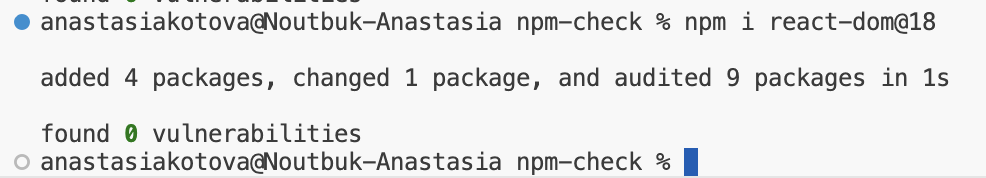
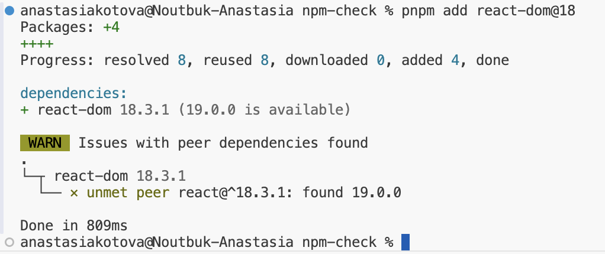
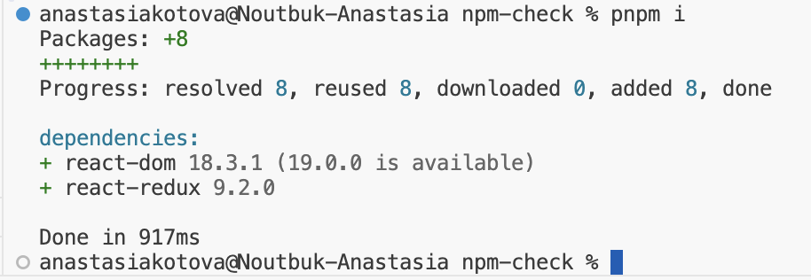

В [первой части](/blog/pnpm-part-1/) мы разобрали, чем pnpm так хорош. А сейчас хочется в двух словах поговорить и про peer deps, которые остались без внимания.

Peer dependencies (или peer deps) — это набор зависимостей, которые должны быть установлены в окружении, где будет работать пакет. Основное их предназначение – обеспечить совместимость этого пакета с определенной версией другого пакета, который должен быть установлен совместно. Например, react-dom требует соответствующую версию react:

```json
{
  "name": "react-dom",
  "version": "18.3.1",
  "peerDependencies": {
    "react": "^18.3.1"
  },
  ...
}
```

Обычно фронтендеру нет необходимости использовать `peerDependencies` в своем проекте, только если он не разрабатывает библиотеку.

## Как работает в npm

До 6 версии npm `peerDependencies` не устанавливались автоматически, а лишь выдавали предупреждение, если в дереве обнаруживалась недействительная версия peer-зависимости. Начиная с npm@7, `peerDependencies` уже устанавливаются по умолчанию. Это поведение можно отключить с помощью параметра `peerDependenciesMeta`.

Вот так это выглядит в библиотеке react-redux:

```json
{
  "name": "react-redux",
  "version": "9.2.0",
  "peerDependencies": {
    "@types/react": "^18.2.25 || ^19",
    "react": "^18.0 || ^19",
    "redux": "^5.0.0"
  },
  "peerDependenciesMeta": {
    "@types/react": {
      "optional": true
    },
    "redux": {
      "optional": true
    }
  },
  ...
}
```

С помощью `optional: true` указывается, какие пакеты не нужно устанавливать при выполнении `npm install`.

## Особенности работы в pnpm

На самом деле, работа с peer deps в pnpm не сильно отличается от работы с другими зависимостями. Однако обозначим несколько моментов.

Pnpm совместим с npm (насколько это возможно). Это значит, что он, как и npm, устанавливает `peerDependencies`, по умолчанию, только если в `peerDependenciesMeta` не указано обратного.

Однако, как и в случае с обычными зависимостями, npm уступает pnpm в вопросах безопасности работы с зависимостями.

## Пример

Рассмотрим на простом примере, в чем отличие.

### Используем npm

Создадим проект, в который добавим пакет react-redux. Так будет выглядеть package.json:

```json
{
  "name": "npm-check",
  "version": "1.0.0",
  "description": "",
  "main": "index.js",
  "scripts": {
    "test": "echo \"Error: no test specified\" && exit 1"
  },
  "keywords": [],
  "author": "",
  "license": "ISC",
  "dependencies": {
    "react-redux": "^9.2.0"
  }
}
```

Библиотека react-redux имеет в своих зависимостях React: `"react": "^18.0 || ^19",`. Поэтому при запуске `npm i` он установится автоматически. Так как в проекте еще нет этого пакета, и других пакетов, где он бы являлся зависимостью, установится самая последняя 19 версия React.

Файл node\_modules/react/package.json:

```json
{
  "name": "react",
  "description": "React is a JavaScript library for building user interfaces.",
  "keywords": [
    "react"
  ],
  "version": "19.0.0",
  ...
}
```

Теперь попробуем установить библиотеку react-dom, которая тоже имеет в peer deps React. Однако установим не последнюю версию, а react-dom@18. Выполним: `npm i react-dom@18`.

Наш package.json:

```json
{
  "name": "npm-check",
  "version": "1.0.0",
  "description": "",
  "main": "index.js",
  "scripts": {
    "test": "echo \"Error: no test specified\" && exit 1"
  },
  "keywords": [],
  "author": "",
  "license": "ISC",
  "dependencies": {
    "react-dom": "^18.3.1",
    "react-redux": "^9.2.0"
  }
}
```

Все было бы хорошо, но react-dom@18 зависит не от 19 версии React, а от 18:

```
  "peerDependencies": {
    "react": "^18.3.1"
  }
```

Посмотрим, какой React у нас установлен сейчас, после установки react-dom@18.

Файл node\_modules/react/package.json:

```json
{
  "name": "react",
  "description": "React is a JavaScript library for building user interfaces.",
  "keywords": [
    "react"
  ],
  "version": "18.3.1",
...
}
```

Таким образом, мы получили:

- неявную смену версии пакета React, которая установилась без нашего ведома
- отсутствие warning-ов при установке react-dom@18, хотя он был несовместим с текущей версией React
- возможность обратиться к установленной версии React из кода приложения, потому что Node.js никак не следит за тем, какие зависимости явно указаны в package.json, главное, чтобы нужный пакет просто находился в ближайшей по иерархии директории node\_modules



*npm не выдает никаких ошибок или предупреждений*

### Используем pnpm

Теперь сделаем все то же самое с помощью pnpm:

Создадим пустой проект с пакетом react-redux последней версии. При выполнении pnpm i увидим, что также установился react@19.0.0. Кроме того, название папки, где будет лежат пакет react-redux имеет следующий вид:

`react-redux@9.2.0_react@19.0.0`

Так pnpm явно указывает с какой версией peer deps здесь используется эта версия библиотеки.

После этого попробуем установить react-dom@18. Во-первых, мы увидим warning в консоли в момент установки, о том, что версии из peer deps не совпадают. Во-вторых, заметим, что установленная версия React осталась 19. И даже пакет react-dom будет использовать 19 версию, о чем нам говорит название папки:

`react-dom@18.3.1_react@19.0.0`

В случае использования pnpm мы получаем:

- warning при установке несогласованных peer deps
- отсутствие неявных обновлений версии React
- невозможность обратиться к React, пока он не будет явно установлен у нас в  проекте.



*pnpm уже выдает предупреждение о неконсистентности зависимостей*

### Как можно решить такую неконсистентость peer deps?

Есть как минимум два варианта.

Первый – просто пересобрать дерево зависимостей. Можно удалить pnpm-lock.yaml и node\_modules и запустить pnpm i снова. Тогда все peer deps разрешатся как надо и оба пакета будут использовать версию react@18.3.1, о чем нам скажут, в частности, названия папок:

`react-dom@18.3.1_react@18.3.1`

`react-redux@9.2.0_react@18.3.1`



*При переустановке всех зависимостей предупреждения больше нет*

Второй – явным образом установить необходимую версию React, в данном случае это 18.

Конкретно эта проблема решается так просто потому, что библиотека react-redux поддерживает в своих peer deps 18 и 19 версию. Однако на практике все может оказаться сложнее. Для таких случаев, в частности, можно использовать блок overrides, который работает и в [pnpm](https://pnpm.io/package_json#pnpmoverrides), и в [npm](https://docs.npmjs.com/cli/v9/configuring-npm/package-json#overrides).

## Вывод

На примере работы с peer dependencies, мы вновь убедились, какими преимуществами обладает pnpm по сравнению с npm. Поэтому я по-прежнему считаю, что стоит начинать переход на pnpm, незаслуженно обделенный вниманием.

## Полезные ресурсы

[Про peerDependencies в npm](https://docs.npmjs.com/cli/v10/configuring-npm/package-json#peerdependencies)

[Про peerDependencies в pnpm](https://pnpm.io/how-peers-are-resolved)
