[В одном из прошлых постов](https://t.me/startpoint_dev/70) мы говорили о таких инструментах, как Prettier, ESLint и Stylelint, и чем они отличаются. А сегодня мы попробуем поэтапно настроить все три библиотеки на нашем проекте, а также настроить прекоммитную проверку с помощью Husky и lint-staged.

В качестве примера проекта будем использовать шаблон react-ts на vite. Начнем нашу настройку с [Prettier](https://prettier.io/docs/en/install.html), так как он требует минимальной конфигурации.

### Prettier

Устанавливаем пакет, используя команду:

```bash
npm install --save-dev --save-exact prettier
```

Далее создаем файл .prettierrc с пустыми фигурными скобками ({}) - это нужно для того, чтобы IDE знали о том, что вы используете Prettier на своем проекте.

После этого установим плагин для Prettier в IDE. Для VSCode он выглядит так:

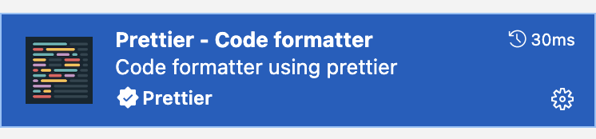

*Prettier Extension для VS Code*

Дальше в настройках IDE нужно указать, каким форматтером мы пользуемся:

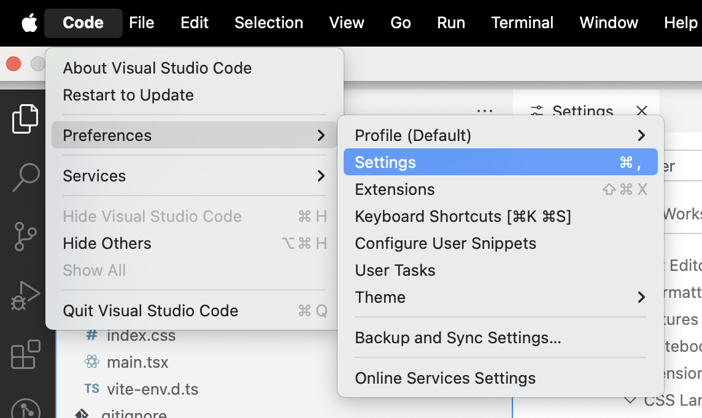

*Настройки в VS Code*

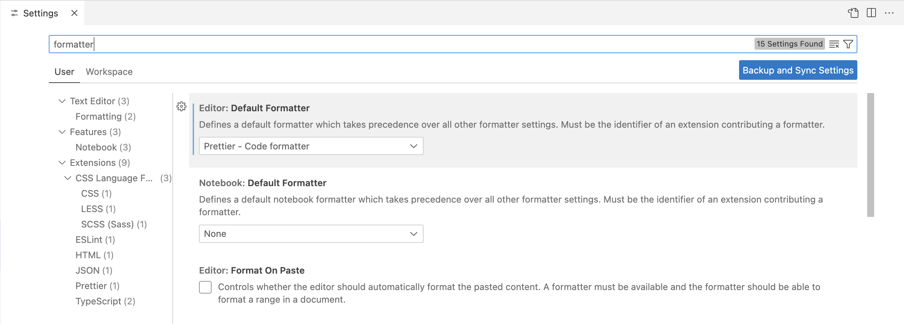

*Ищем по ключевому слову "formatter"*

А также можно выставить опцию, которая позволяет IDE автоматически форматировать файлы после сохранения:

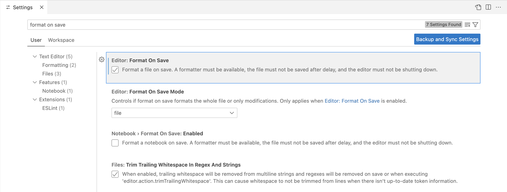

Готово! Теперь проект будет форматироваться с помощью Prettier. Вот как это работает:

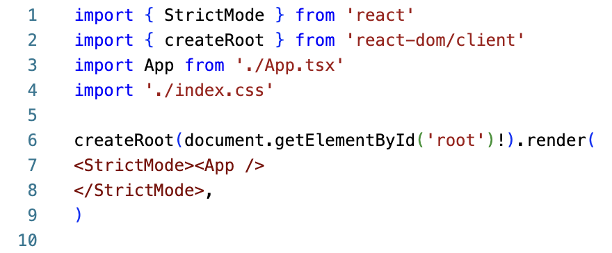

*Пример кода без форматирования*

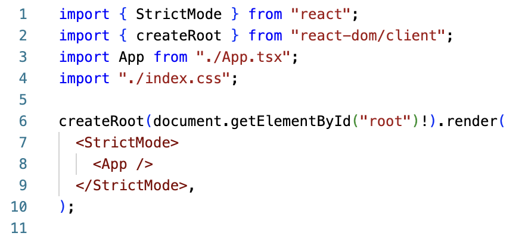

*Пример кода с форматированием*

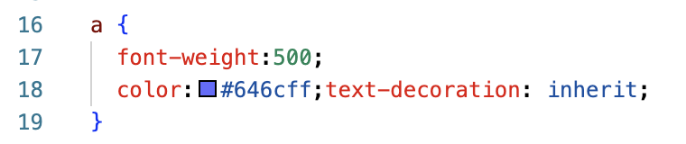

*Пример кода без форматирования*

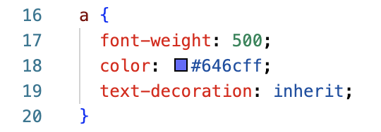

*Пример кода с форматированием*

Однако, Prettier не будет подчеркивать неправильный код, например такой:

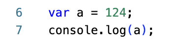

*Использование var никак не подчеркивается в IDE без использования ESLint*

Кроме этого у нас не будет автоматической сортировки импортов, что может быть очень полезно в больших файлах.

Аналогично с CSS, такой код никак не будет валидироваться в IDE:

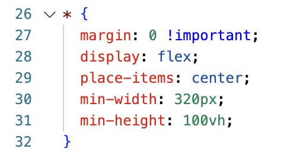

*Нет сортировки свойств, никак не подчеркиваются !important и общий селектор \**

Чтобы добиться более серьезной валидации кода, нам нужно подключить и использовать ESLint и Stylelint. Поэтому подключим и настроим две эти библиотеки.

### ESLint

Устанавливаем пакет, согласно [документации](https://eslint.org/docs/latest/use/getting-started):

```bash
npm init @eslint/config@latest
```

В процессе выполнения данной команды предлагается несколько вопросов, отвечаем на них исходя из нашего проекта и того, что мы хотим:

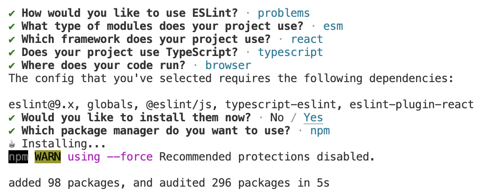

*Первоначальная установка и настройка ESLint*

После этого в директории у нас появляется автоматически сгенерированный файл eslint.config.js с первоначальными настройками.

Далее устанавливаем плагин для IDE, если он еще не установлен:

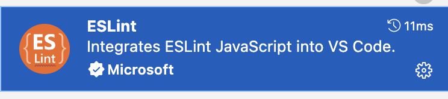

*ESLint Extension для VS Code*

И сразу после этого мы начинаем видеть базовые подсказки в IDE:

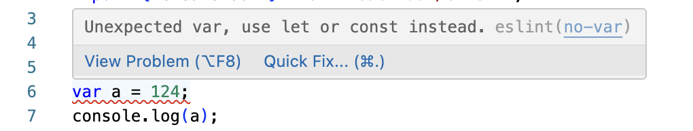

*Использование var теперь подчеркивается в IDE*

Однако, так как мы используем на нашем проекте Prettier, нужно донастроить ESLint так, чтобы их правила не конфликтовали друг с другом. Для этого можно использовать специальный конфиг для ESLint [eslint-config-prettier](https://github.com/prettier/eslint-config-prettier).

Устанавливаем пакет:

```bash
npm install --save-dev eslint-config-prettier
```

И затем добавляем новую конфигурацию в eslint.config.js:

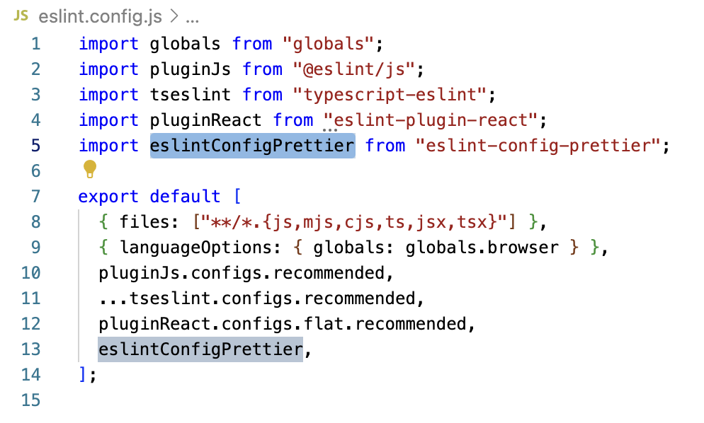

*Добавляем конфиг как указано в Readme eslint-config-prettier*

Также вы можете указать в настройках VSCode, какие действия и когда нужно запускать при сохранении файла:

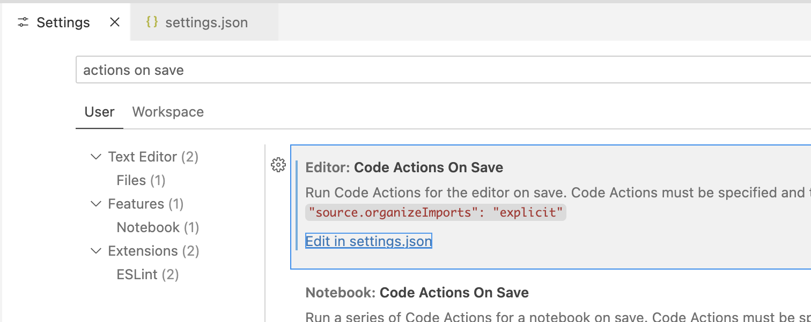

*Переходим в settings.json через пункт в настройках Code Actions On Save*


*Укажем, что при явном или автоматическом сохранении файла нужно запускать ESLint*

Готово! Теперь после сохранения файла IDE автоматически заменит неправильный код, если такое возможно:


*IDE заменила var на const*

При установке ESLint также поставились рекомендованные конфиги для React, однако не все правила в этих конфигах нам подходят. Например, правило о том, что в файле с JSX должен быть явно указан импорт React:

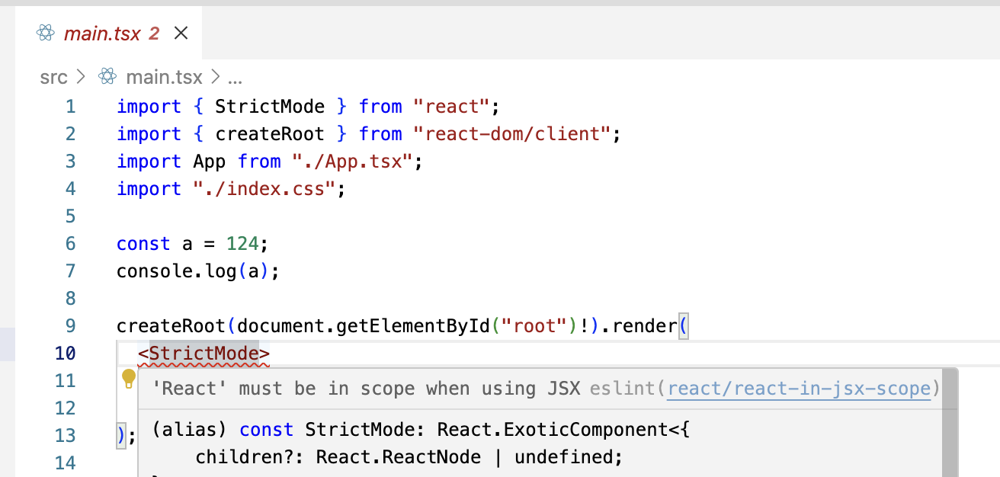

*Правило react/react-in-jsx-scope*

Т.к. мы знаем название правила, то легко можем переопределить его в нашем конфиге:

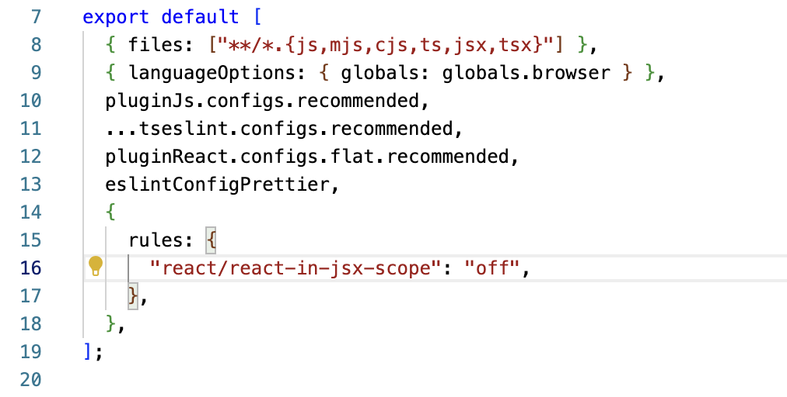

*Добавили блок для переопределения правил*

И теперь ошибка больше не подчеркивается:

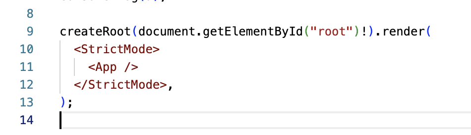

*IDE больше не ругается на JSX*

Кроме этого, добавим сортировку импортов. В ESLint есть правило, которое проверяет сортировку - sort-imports, однако оно [не обеспечивает автоматическую перестановку строк](https://eslint.org/docs/latest/rules/sort-imports#rule-details).

Воспользуемся сторонним плагином [eslint-plugin-simple-import-sort](https://github.com/lydell/eslint-plugin-simple-import-sort/).

Установим его с помощью команды:

```bash
npm install --save-dev eslint-plugin-simple-import-sort
```

А затем добавим нужные настройки в наш конфиг:

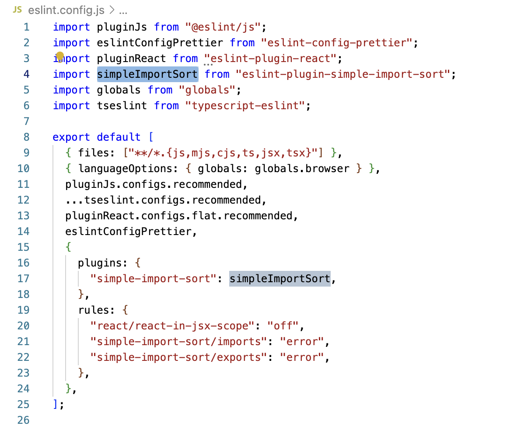

*Файл eslint.config.js с новыми правилами*

Возможно, потребуется перезапутить IDE.

После этого мы сможем увидеть ошибки на неправильно отсортированных импортах:

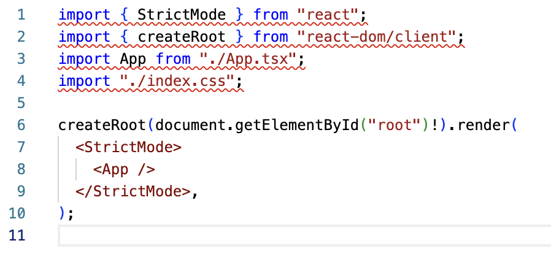

*ESLint подчеркивает неправильно отсортированные импорты в файле*

После того как мы пересохраним наш файл, в IDE сработает автоматическое исправление и импорты будут отсортированы:

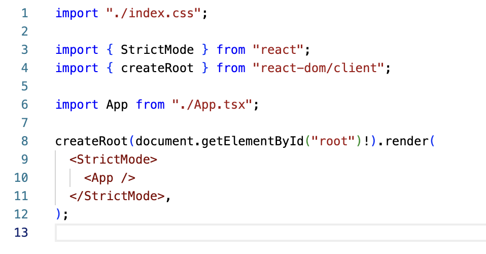

*Теперь наши импорты отсортированы и разбиты на группы*

Готово! Осталось подключить линтер к нашим CSS-файлам, и для этого будем использовать [Stylelint](https://stylelint.io/user-guide/get-started).

### Stylelint

Устанавливаем пакет:

```bash
npm init stylelint
```

В проекте также появился файл со стандартными настройками:

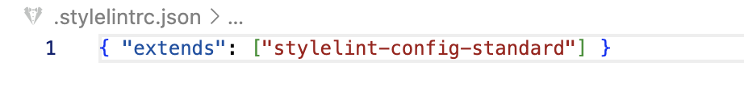

*Новый файл .stylelintrc.json*

Устанавливаем плагин в IDE:

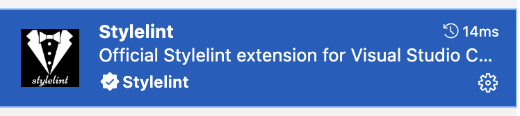

*Stylelint Extension в VS Code*

И расширяем настройки самой IDE, чтобы у нас также работало автоматическое исправление:

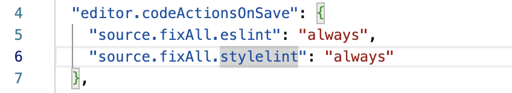

*Укажем, что при явном или автоматическом сохранении файла нужно запускать Stylelint*

Теперь даже без дополнительной настройки IDE уже подсказывает какие-то моменты в файлах CSS:

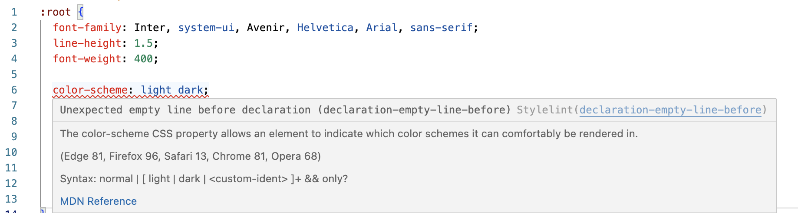

*Указывает на ненужные пустые строчки*

Добавим явный запрет на использование !important и общего селектора \*:

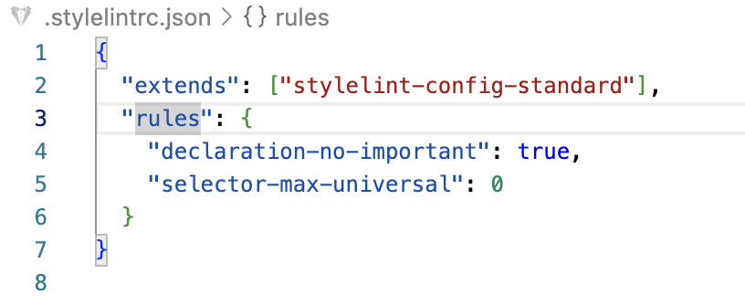

*Добавляем новые правила в конфиг*

Теперь IDE подчеркивает в нашем коде некорректные моменты:

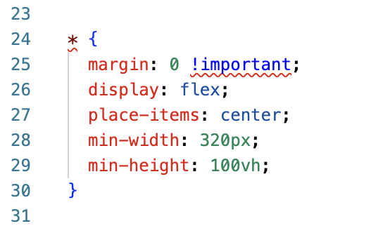

*CSS-код валидируется так, как мы хотели*

Последний шаг - это настройка pre-commit hook в git, чтобы измененные файлы проверялись с помощью ESLint и Stylelint.

### Husky и lint-staged

По [документации](https://typicode.github.io/husky/get-started.html) устанавливаем и настраиваем husky:

```bash
npm install --save-dev husky
npx husky init
```

У нас появился файл .husky/pre-commit, в котором нужно будет указать то, что необходимо выполнить перед коммитом. Именно там должна быть команда проверки наших измененных файлов.

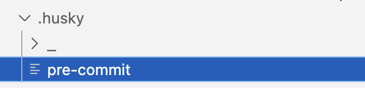

*Новый файл для конфигурации husky pre-commit*

Для того, чтобы проверять только файлы, которые изменились, можно использовать пакет [lint-staged](https://github.com/lint-staged/lint-staged). Устанавливаем его:

```bash
npm install --save-dev lint-staged
```

Настраиваем, добавляя секцию lint-staged в package.json, где указываем, каким линтером для каких файлов пользоваться:

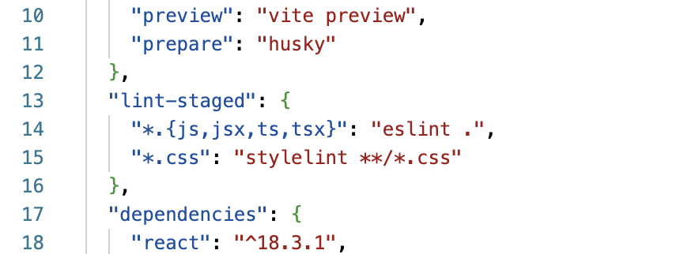

*Дополняем package.json*

Теперь в файл .pre-commit добавляем команду для его запуска:

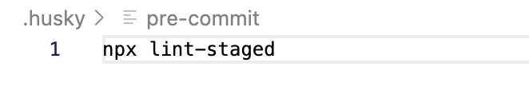

*Изменяем файл конфигурации .husky.pre-commit*

Готово! Теперь при попытке закоммитить что-то не то в измененных файлах будет выпадать ошибка.

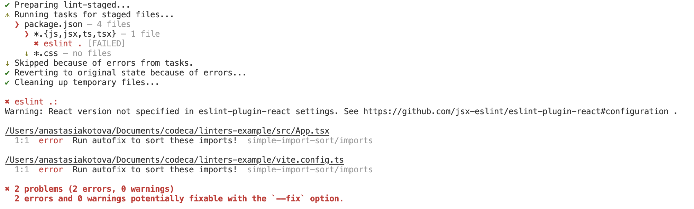

*Ошибка ESLint*

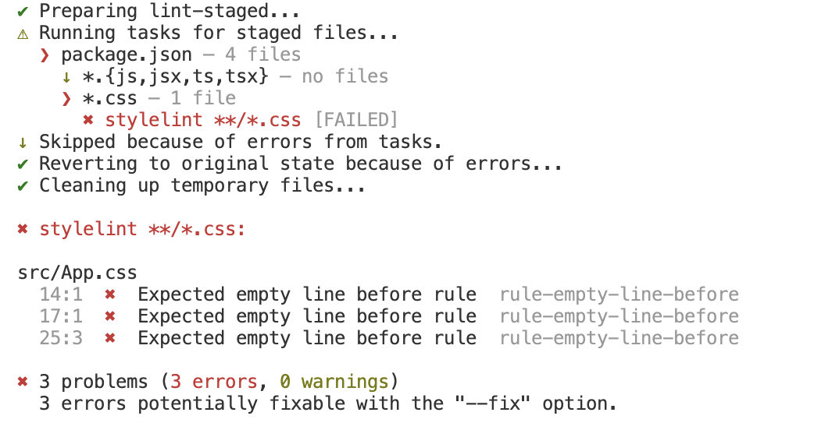

*Ошибка Stylelint*

Lint-staged может быть особенно полезен, если вы добавляете линтеры на проект с большой кодовой базой и не хотите разом обновлять все файлы в проекте.

📂 Подробнее пример как всегда можно посмотреть в [моём GitHub](https://github.com/startpointforl/linters-example)
