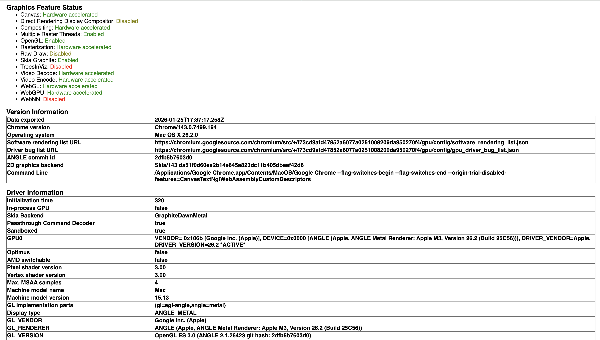

В первой части мы разобрали, как работает браузер Chromium на уровне процессов и потоков. Теперь пришло время проследить полный путь от HTML, CSS и JavaScript до конкретных пикселей на экране. Этот путь называется конвейером рендеринга

## Начало и конец конвейера

Контент — это общий термин в Chromium для всего кода внутри веб-страницы или фронтенда веб-приложения. Он не включает в себя UI самого браузера, например адресную строку или элементы навигации. Основными строительными блоками контента являются:

- текст,
- изображения,
- HTML — разметка, окружающая текст,
- CSS — стили, определяющие способ отображения разметки,
- JavaScript — скрипты, которые могут динамически изменять всё вышеперечисленное.

Настоящая веб-страница представляет собой набор HTML, CSS и JavaScript-файлов, передаваемых по сети в виде обычного текста. Здесь нет этапов компиляции или упаковки, как это бывает на других программных платформах: исходный код страницы является прямым входом для системы рендеринга.

На другом конце конвейера браузеру необходимо вывести пиксели на экран, используя графические библиотеки операционной системы. Внутри Chromium ключевую роль играет библиотека [Skia](https://skia.org/) — именно она отвечает за отрисовку примитивов, текста, изображений и эффектов. Skia можно рассматривать как универсальный графический движок, абстрагирующий работу с конкретным «железом». На этапе raster браузер формирует команды рисования в терминах Skia, а затем транслирует их в вызовы низкоуровневых графических API, доступных на конкретной платформе.

В зависимости от системы и конфигурации Chromium может использовать разные бэкенды. Чтобы посмотреть, с каким именно графическим стеком работает браузер, можно открыть служебную страницу `chrome://gpu`. На ней отображается таблица с технической информацией, например, у меня она выглядит следующим образом:



*Таблица со страницы chrome://gpu*

Здесь видно, что основным 2D-бэкендом является Skia (поле `2D graphics backend`), а в качестве графического движка используется связка Graphite, Dawn и Metal (поле `Skia Backend`). Это означает, что все операции рисования сначала проходят через Skia, затем обрабатываются новым рендер-ядром [Graphite](https://blog.chromium.org/2025/07/introducing-skia-graphite-chromes.html), переводятся через слой WebGPU-инфраструктуры [Dawn](https://dawn.googlesource.com/dawn) и в итоге выполняются с помощью нативного API Apple — Metal. Параллельно браузер использует библиотеку ANGLE, которая транслирует вызовы OpenGL ES в Metal, позволяя Chromium сохранять единый графический интерфейс для разных платформ (поле `Display type`). Также из таблицы видно, что GPU работает в отдельном изолированном процессе, что повышает стабильность и безопасность (поля `In-process GPU` и `Sandboxed`), а фактический рендерер представляет собой Metal-реализацию под Apple M3 (поле `GL_RENDERER`).

Таким образом, Chromium не привязан к одному графическому API. Skia выступает в роли промежуточного слоя, а выбор конкретного бэкенда происходит динамически, исходя из платформы, драйверов и возможностей устройства. Это позволяет браузеру сохранять единый конвейер рендеринга и при этом эффективно использовать графическое ускорение в самых разных средах.

## Основные стадии конвейера

Цель рендеринга можно сформулировать так: преобразовать HTML, CSS и JavaScript в корректные вызовы графической платформы для отображения пикселей. Однако при описании конвейера важно учитывать и вторую задачу: браузеру необходимы промежуточные структуры данных для эффективного обновления интерфейса и обработки запросов со стороны JavaScript и других подсистем.

Поэтому внутри Chromium конвейер рендеринга реализован как последовательность этапов, каждый из которых строит собственные структуры данных и подготавливает информацию для следующего шага. Важно понимать, что браузер не «перерисовывает страницу целиком» при каждом изменении. Он стремится переиспользовать уже вычисленные данные и обновлять только то, что действительно изменилось. Современная архитектура этого процесса описывается в рамках подхода [RenderingNG](https://developer.chrome.com/docs/chromium/renderingng-architecture).

В RenderingNG каждый кадр формируется в несколько этапов, которые условно делятся на три группы: подготовку данных на основном потоке (main thread), работу композитного потока (compositor thread) и финальный вывод через GPU (viz process). Внутри этих групп находятся конкретные стадии, выполняемые в строго определённом порядке. При этом не каждый кадр обязан проходить все этапы полностью: если изменения затрагивают только визуальные эффекты или прокрутку, браузер может обойтись без перерасчёта геометрии и повторной отрисовки контента.

Все начинается с **парсинга** HTML. Браузер анализирует текст документа, восстанавливает вложенность тегов и строит DOM — древовидную структуру, отражающую логическую организацию страницы.

Затем на стадии **animate** обновляются анимации, переходы и другие эффекты, зависящие от времени. Здесь формируются специальные структуры данных, описывающие прозрачность, трансформации, обрезку и другие визуальные свойства элементов. Эти данные позволяют изменять внешний вид элементов без полного пересчёта страницы.

После этого выполняется обработка **стилей**. Браузер вычисляет итоговые значения CSS-свойств для каждого элемента, учитывая каскад, наследование и специфичность.

Следующим этапом является **layout** — вычисление геометрии страницы. На этой стадии определяется размер и положение всех элементов, формируется дерево фрагментов, описывающее будущий макет. Это один из самых ресурсоёмких этапов, так как изменение одного элемента может повлиять на множество других.

На стадии **pre-paint** браузер обновляет визуальные структуры и определяет, какие части изображения больше нельзя переиспользовать. Это позволяет точно вычислить области, требующие перерисовки.

Далее следует стадия **scroll**, отвечающая за обновление прокрутки. Вместо пересчёта всей страницы браузер изменяет смещение области просмотра, используя уже существующие структуры данных.

На стадии **paint** формируется display list — список команд, описывающих, что и в каком порядке должно быть нарисовано. Этот список не привязан к конкретному графическому API и служит промежуточным представлением между логикой страницы и реальной отрисовкой.

После этого данные передаются с основного потока на композитный — этап **commit**. Он отделяет подготовку данных от визуального отображения, позволяя основному потоку продолжать выполнение JavaScript.

На стадии **layerize** сцена разбивается на композитные слои. Эти слои могут перемещаться и анимироваться независимо, однако их количество ограничивается соображениями производительности.

Далее следует **растрирование**, в ходе которого команды из display list преобразуются в текстурные тайлы, используемые GPU.

На стадии **activate** формируется compositor frame — описание структуры будущего кадра.

На этапе **aggregate** в viz-процессе объединяются кадры от разных источников: вкладок, интерфейса браузера и встроенных фреймов.

Финальной стадией является **draw** — непосредственная отрисовка кадра GPU и вывод изображения на экран.

По итогу пайплайн рендеринга в Chromium (RenderingNG) выглядит так:

```
1. Парсинг
   → парсинг HTML и CSS
   → построение DOM и таблиц стилей
2. Animate
   → обновление анимаций и временных эффектов
3. Style
   → применение CSS и вычисление итоговых стилей
4. Layout
   → расчёт размеров и позиций элементов
5. Pre-paint
   → подготовка к отрисовке, обновление визуальных состояний
6. Scroll
   → обработка прокрутки и смещения контента
7. Paint
   → формирование команд отрисовки
8. Commit
   → передача данных с main thread на compositor
9. Layerize
   → разбиение сцены на слои
10. Raster / Decode / Paint Worklets
   → растрирование, декодирование изображений, генерация текстур
11. Activate
   → сборка кадра для отображения
12. Aggregate
   → объединение кадров от разных источников
13. Draw
  → отрисовка через GPU
```

## CPU и GPU задачи в Chromium

В современном конвейере рендеринга в Chromium чётко прослеживается граница между задачами CPU и GPU. Все этапы, связанные с анализом структуры страницы — парсинг, построение DOM, вычисление стилей, layout и формирование инструкций paint — выполняются на стороне CPU. Эти задачи требуют сложной логики и интерпретации спецификаций, что пока эффективнее реализуется на процессоре.

В то же время растеризация и финальный вывод выполняются на GPU. Графический процессор отвечает за преобразование команд рисования в пиксели, применение шейдеров, декодирование изображений и работу с нативными графическими API, такими как Metal, Vulkan или DirectX. Такое разделение позволяет CPU сосредоточиться на логике страницы, а GPU — на параллельной обработке графики. Перенос части compositing-операций в отдельные потоки дополнительно снижает нагрузку на основной поток и повышает отзывчивость интерфейса.
