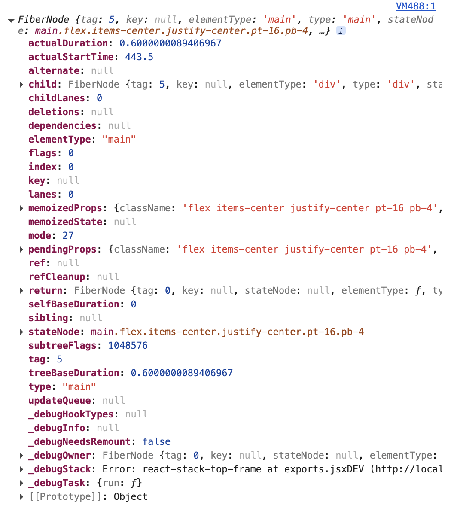
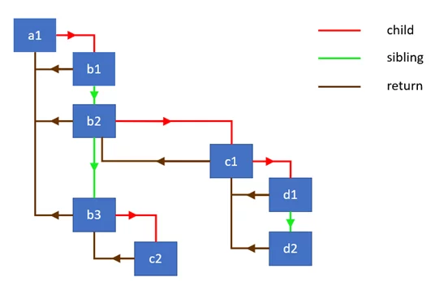
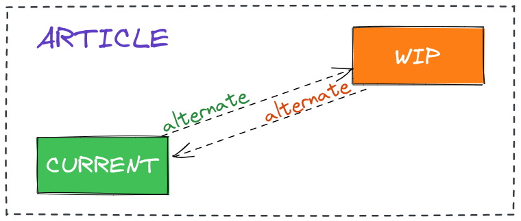
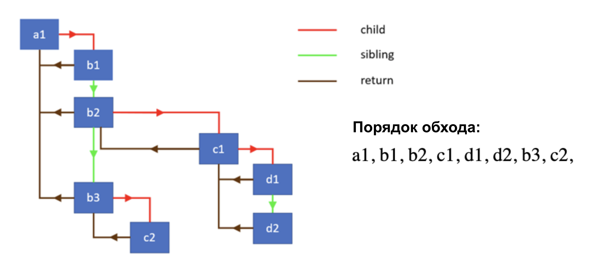

В прошлых частях мы рассмотрели, как работает рендеринг в браузере на примере Chromium. В этой статье обсудим, как работает рендеринг компонентов уже внутри React, и какие подходы использует React, чтобы делать его быстрым и неблокирующим.

## Элементы, компоненты и виртуальный DOM

Когда разработчик пишет JSX, под капотом инструмент сборки (например Babel или esbuild) компилирует его в вызовы `React.createElement`. Выражение `<Button color="blue" />` превращается в `React.createElement(Button, { color: "blue" })`, результатом которого является простой JavaScript-объект — React-элемент. Это не экземпляр компонента и не DOM-узел, а лишь описание того, что нужно отрендерить: тип, пропсы и дочерние элементы. Эти элементы пересоздаются заново при каждом рендере, но на их основе React работает с совершенно другой структурой данных, которая живёт значительно дольше.

Раньше эта структура называлась "виртуальный DOM", однако начиная с 16 версии команда React отказалась от этого определения. Причина в том, что React работает не только с DOM, например, есть React Native. Структура, которая используется всеми платформами, одинаковая, но реальную работу по отрисовке на платформе выполняет уже конкретный renderer. Поэтому говорить про "виртуальный DOM" как про универсальную концепцию не совсем корректно — правильнее говорить о дереве fiber-узлов.

## Fiber-узел: виртуальный стековый фрейм

**Fiber** — это обычный JavaScript-объект, который является основной единицей работы в React с версии 16. Каждому компоненту в дереве соответствует свой fiber-узел, и в отличие от React-элементов, которые пересоздаются на каждый рендер, fiber-узлы мутируют и живут столько, сколько живёт компонент. Так React не воссоздаёт всё дерево заново, а обновляет существующие узлы.

Каждый fiber-узел хранит в себе достаточно много информации: например, тип компонента (`type`), его пропсы в двух вариантах — `pendingProps` (те, что будут использованы в текущем рендере) и `memoizedProps` (те, что были использованы в последнем завершённом рендере). Хуковое состояние функциональных компонентов хранится в `memoizedState` в виде связного списка, где каждый узел соответствует одному вызову хука. Очередь запланированных обновлений находится в `updateQueue`.

Посмотреть на объект fiber можно через DOM-элемент компонента в консоли вашего браузера, например:

```js
const el = document.getElementById('root').firstChild;
const fiberKey = Object.keys(el).find(k => k.startsWith('__reactFiber'));
const fiber = el[fiberKey];
console.log(fiber);
```

Выведет примерно:



*Пример fiber-узла*

Для навигации по дереву fiber использует три указателя: `child` — на первого потомка, `sibling` — на следующего брата, и `return` — на родителя. Такая структура позволяет обходить дерево итеративно без рекурсии — именно это стало ключевым техническим решением, которое отличает Fiber от предыдущего Stack Reconciler.



*Пример fiber-дерева и его указателей*

Прежний Stack Reconciler использовал простую рекурсию и при обходе дерева полагался на встроенный стек вызовов JavaScript, который невозможно прервать: начавшись, рекурсия обязана дойти до конца. Fiber позволил отказаться от рекурсии, и теперь React управляет обходом сам: может отложить, приостановить или отменить его в любой момент.

## Двойная буферизация: current и workInProgress

React всегда поддерживает в памяти не одно, а два дерева fiber-узлов. Первое называется **current** — это дерево, которое сейчас отображается на экране. Второе называется **workInProgress** — дерево, над которым ведётся работа в данный момент. Когда приходит обновление, React не изменяет current-дерево напрямую, а строит новое workInProgress-дерево, клонируя существующие узлы через поле `alternate`. Каждый fiber-узел в current-дереве содержит указатель `alternate` на свой двойник в workInProgress-дереве, и наоборот. Когда работа завершена и наступает момент применить изменения к DOM, React просто переставляет указатели: workInProgress-дерево становится новым current, а старое current превращается в заготовку для следующего workInProgress. Эта техника называется двойной буферизацией и именно она гарантирует, что пользователь никогда не увидит промежуточное, рассогласованное состояние интерфейса.



*Пример связи current и workInProgress узлов*

При обновлениях React старается максимально переиспользовать существующие fiber-узлы. Если у узла нет изменений, React может применить оптимизацию — пропустить его и всё поддерево полностью, что значительно сокращает объём работы. Именно на этом принципе работают `React.memo`, `useMemo` и `shouldComponentUpdate`: они помогают React как можно чаще принимать решение об оптимизации.

## Work Loop: beginWork и completeWork

Обход дерева происходит внутри цикла `while`. Цикл берёт текущий `workInProgress`-узел и вызывает для него `performUnitOfWork`. Внутри этой функции происходят две вещи. Сначала вызывается `beginWork` — функция, которая отвечает за нисходящую часть обхода: она вызывает функцию компонента или метод `render`, сравнивает полученный результат с предыдущим, создаёт или обновляет дочерние fiber-узлы и возвращает ссылку на следующего потомка. Если потомок есть, work loop переходит к нему и повторяет процесс. Как только `beginWork` возвращает `null`, достигнут листовой узел дерева — дальше идти некуда.

В этот момент вызывается `completeWork` — восходящая часть обхода. Для узлов, которые соответствуют DOM-элементам, именно здесь создаётся или обновляется реальный DOM-узел — но не добавляется в документ, а лишь подготавливается в памяти. Узлы, которые требуют каких-либо изменений (вставка, обновление, удаление, вызов эффектов), помечаются флагами. После завершения `completeWork` узел поднимается к родителю через указатель `return`, либо work loop переходит к братскому узлу через `sibling`. Таким образом, обход идёт по принципу "сначала в глубину, потом вправо, потом вверх".



*Порядок обхода для примера fiber-дерева*

## Планировщик и система приоритетов Lanes

Не все обновления одинаково важны, и React это понимает. Система приоритетов в современных версиях React реализована через механизм **Lanes** — битовую маску, представляющую одновременно приоритет и группу обновлений. Чем меньше численное значение лейна, тем выше приоритет: клик пользователя имеет значение `0b0000000000000000000000000001000`, а фоновые переходы (transitions) — `0b0000000001111111111111100000000`. Когда React решает, с чего начинать работу, он вызывает `getNextLanes`, которая возвращает набор лейнов с наивысшим приоритетом.

Планировщик работы принимает колбэк и уровень приоритета, и запускает задачу в подходящий момент. Когда React начинает работу над деревом, он проверяет специальный флаг от планировщика внутри work loop — и если планировщик сигнализирует, что время вышло и нужно уступить поток браузеру, цикл прерывается. Работа сохраняется в `workInProgress`-дереве и возобновляется при следующем вызове. Именно так достигается прерываемость рендеринга. При этом если обновление попало в `BlockingLane` (например, синхронный вызов из обработчика события), React выполняет работу до конца без прерываний.

## Commit Phase: три прохода по дереву

Когда render phase завершена и `workInProgress`-дерево полностью построено, начинается **commit phase** — она всегда синхронна и не может быть прервана. Прерывание здесь недопустимо: если применить половину изменений и остановиться, пользователь увидит рассогласованный интерфейс. Commit phase в исходном коде React состоит из трёх последовательных проходов по дереву, каждый из которых отвечает за свой класс работ.

На первом подходе вызывается, например, `getSnapshotBeforeUpdate` у классовых компонентов и выполняются некоторые другие операции.

Второй проход — это и есть собственно изменение DOM: вставка, обновление атрибутов, удаление узлов, обновление ref'ов. Именно в конце этого прохода происходит и смена указателей: `root.current` переключается с бывшего `current`-дерева на `workInProgress`, которое с этого момента становится новым `current`.

Третий проход запускает `useLayoutEffect` и его аналоги у классовых компонентов. Всё это выполняется в рамках одного синхронного таска JavaScript, именно поэтому `useLayoutEffect` уже использует новые значения DOM, но браузер ещё не успел их фактически отрисовать. Подробнее про useLayoutEffect можно прочитать в [моей статье](/blog/use-layout-effect/).

После этого, уже асинхронно через браузерное API `MessageChannel`, запускаются пассивные эффекты из `useEffect`. Такое разделение не случайно: `useLayoutEffect` выполняется синхронно до того, как браузер успел отрисовать изменения, поэтому он подходит для измерений DOM, а `useEffect` — для операций, которые могут подождать.

## Как это знание применять на практике

Понимание того, как устроен Fiber изнутри, помогает принимать более осознанные решения. Когда компонент рендерится, React вызывает его функцию, получает React-элементы, затем reconciler сравнивает их с соответствующими fiber-узлами и решает, нужна ли реальная работа. Лишний рендер функции компонента — это дёшево; лишнее изменение DOM — дорого. Поэтому оптимизации вроде `React.memo` имеют смысл тогда, когда компонент рендерится часто, а его пропсы меняются редко — в этом случае React применяет оптимизацию и не тратит время на `beginWork` для всего поддерева. Для тяжёлых обновлений, которые не требуют немедленного отклика, `useTransition` позволяет явно поместить работу в `TransitionLanes` — и тогда React сможет прервать этот рендер, если появится более срочное обновление, например ввод пользователя. Fiber даёт React полный контроль над тем, когда и в каком порядке выполнять работу — и именно это лежит в основе всей современной архитектуры React.
