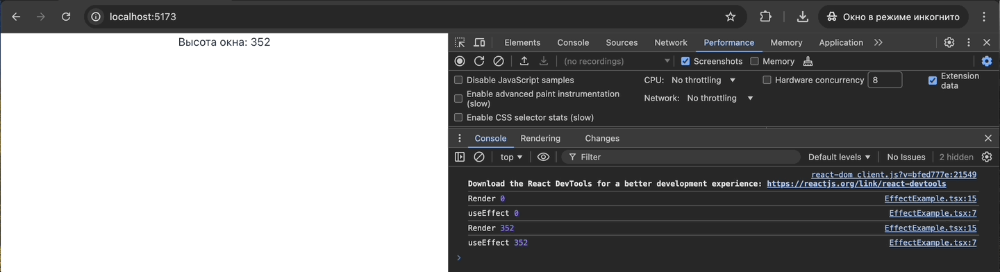
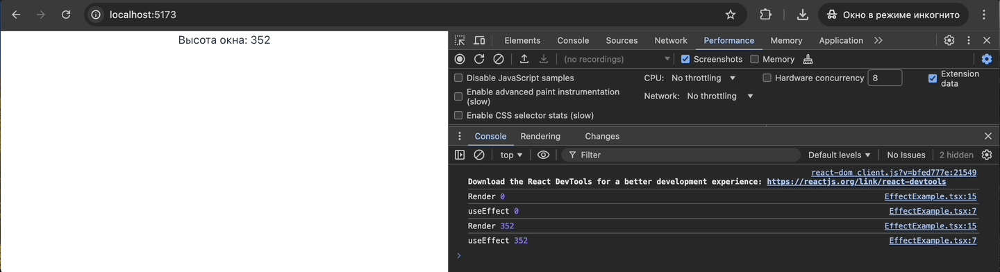
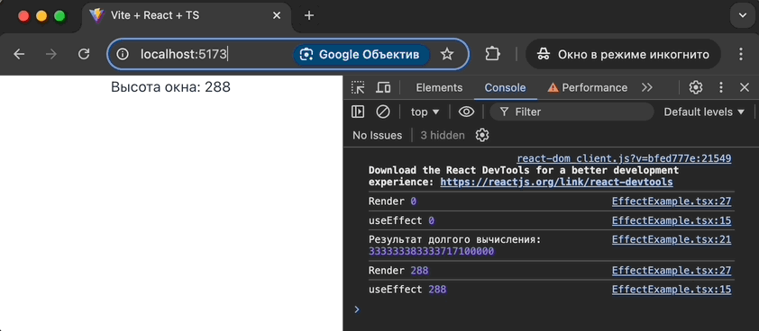
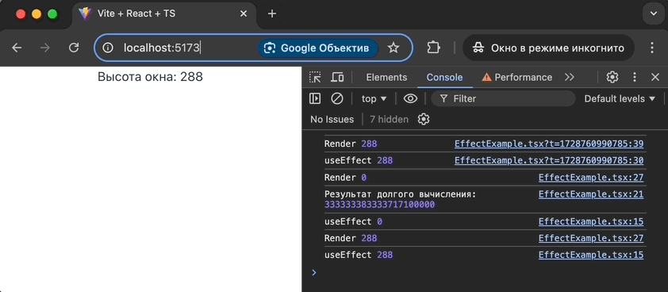

В React есть интересный хук - useLayoutEffect. С первого взгляда, его можно спутать с useEffect, однако между ними есть одно существенное различие.

Исходя из [документации React](https://react.dev/reference/react/useLayoutEffect), useLayoutEffect — это версия useEffect, которая срабатывает до того, как браузер перерисует экран. Что это значит? Давайте разберемся на примере.

Пусть, у нас есть компонент, который должен вычислить текущую высоту экрана браузера и вывести её на экран. Очевидно, что мы можем это сделать только после рендера нашего приложения на клиенте, когда мы имеем доступ к window и document.body.

```jsx
import { useEffect, useState } from "react";

export function EffectExample() {
  const [windowHeight, setWindowHeight] = useState(0);

  useEffect(() => {
    console.log("useEffect", windowHeight);
  }, [windowHeight]);

  useEffect(() => {
    const body = document.body;
    setWindowHeight(body.getBoundingClientRect().height);
  }, []);

  console.log("Render", windowHeight);

  return <div>Высота окна: {windowHeight}</div>;
}
```

Если мы будем использовать такой код, он действительно будет работать, однако мы получим неприятные эффекты при замедлении работы браузера, например, если наше устройство не сильно производительное, или если наши вычисления и действия, связанные с полученной высотой, будут сложнее, чем просто вывести значение высоты на экране.



*При использовании useEffect на немощном устройстве можно заметить скачок с 0 до итогового значения при выводе "Высота окна: ...". Используем замедление CPU на вкладке Performance, чтобы эмулировать такое устройство*

На помощь нам как раз может прийти хук useLayoutEffect. Перепишем код нашего компонента:

```jsx
import { useEffect, useLayoutEffect, useState } from "react";

export function EffectExample() {
  const [windowHeight, setWindowHeight] = useState(0);

  useEffect(() => {
    console.log("useEffect", windowHeight);
  }, [windowHeight]);

  useLayoutEffect(() => {
    const body = document.body;
    setWindowHeight(body.getBoundingClientRect().height);
  }, []);

  console.log("Render", windowHeight);

  return <div>Высота окна: {windowHeight}</div>;
}
```

Теперь неприятных морганий интерфейса больше не будет.



*При использовании useLayoutEffect скачок с 0 до итогового значения уже отсутствует*

С чем это связано? Дело в том, что useLayoutEffect, в отличие от useEffect, является синхронным хуком, и выполняется в тот момент, когда React уже закончил все необходимые вычисления, применил изменения к DOM, но браузер ещё не успел отрисовать итоговое состояние.

Таким образом, хук useLayoutEffect может быть полезен для ситуаций, когда нам нужно отобразить что-то на экране на основе предварительно вычисляемых размеров элементов или других данных, и при этом мы не хотим, чтобы наше содержимое каким-либо образом моргало при отображении.

Однако, стоит помнить, что код внутри useLayoutEffect и все запланированные из него обновления состояния, блокируют перерисовку экрана браузером. Так, если мы добавим в наш хук какой-то тяжелый асинхронный код, то сможем наблюдать проблемы со скоростью отображения данных на экране:

```js
  useEffect(() => {
    const largeArray = Array.from({ length: 1e7 }, (_, i) => i + 1);
    const result = sumOfSquares(largeArray);
    console.log("Результат долгого вычисления:", result);

    const body = document.body;
    setWindowHeight(body.getBoundingClientRect().height);
  }, []);
```



*При использовании useEffect мы сразу же видим какие-то данные на экране, пусть и не совсем корректные*

```js
  useLayoutEffect(() => {
    const largeArray = Array.from({ length: 1e7 }, (_, i) => i + 1);
    const result = sumOfSquares(largeArray);
    console.log("Результат долгого вычисления:", result);

    const body = document.body;
    setWindowHeight(body.getBoundingClientRect().height);
  }, []);
```



*При использовании useLayoutEffect мы вынуждены продолжительное время смотреть на пустой экран*

Поэтому в документации команда React явно предупреждает нас о том, что все же предпочтительно использовать useEffect, так как useLayoutEffect может приводить к потенциальным проблемам с производительностью.
